# 神经网络图编译技术原理

## 1. 图编译概述

### 1.1 什么是图编译器

神经网络图编译器是将高层次的深度学习模型表示（如ONNX、TensorFlow Graph）转换为底层硬件可执行代码的系统。与解释执行不同，图编译器在模型运行前完成所有优化和代码生成，生成的高度优化的二进制序列可以直接在加速器上执行。

现代AI加速器（如高通Hexagon DSP）采用复杂的内存层次结构：大容量的DDR作为权重存储，小容量但高带宽的VTCM（Vector Tightly Coupled Memory）用于活跃张量计算。图编译器的核心任务是决定哪些张量驻留VTCM、何时通过DMA在DDR和VTCM之间搬运数据、以及如何调度算子执行以最大化硬件利用率。

图编译器的核心设计理念源于传统编译器技术，但针对神经网络的特定模式进行了深度优化。与通用编译器不同，神经网络图编译器面对的是高度规则的计算模式：大量的矩阵乘法、逐元素操作、归约操作。这些模式允许编译器应用激进的优化策略，如算子融合、内存复用、向量化等。

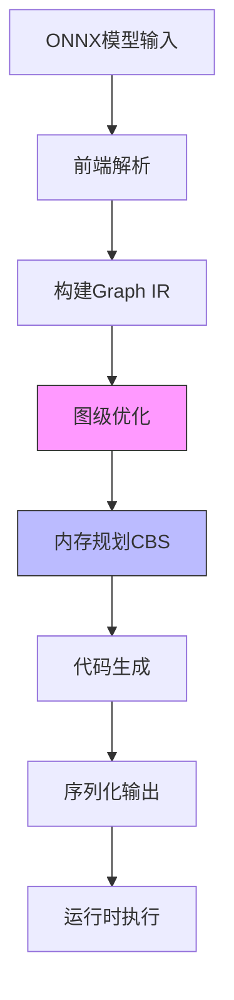

### 1.2 图编译vs解释执行

解释执行模式在运行时动态决定算子调度和内存分配，灵活性高但无法执行跨算子的全局优化。每次执行一个算子时，解释器需要查找对应的实现、分配输出内存、设置参数、调用内核，这些开销在简单模型中可能占主导。

图编译模式则通过静态分析整个计算图，可以实施激进的优化策略。算子融合消除中间结果存储，内存复用减少总占用，数据布局转换匹配硬件偏好。这些优化在编译阶段完成，执行时只需按预生成的计划执行，开销极低。

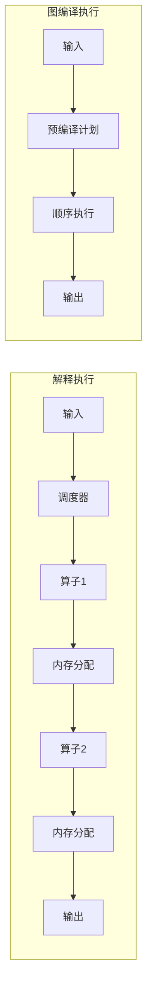

以Transformer模型中的注意力计算为例。解释执行会分别执行Query投影、Key投影、Value投影、QK点积、Softmax、注意力加权、输出投影七个独立算子，每个都读写内存。图编译可以识别这一模式并融合为单一Attention算子，中间结果直接在寄存器传递，无需落内存。实测中，这种融合可以将注意力计算的性能提升2-5倍。

### 1.3 编译Pipeline总览

图编译器通常采用多阶段pipeline架构。第一阶段解析输入模型构建内部IR（Intermediate Representation），将高层次的模型描述转换为编译器内部的结构化表示。第二阶段执行图级优化，包括常量传播、死代码消除、公共子表达式消除、算子融合等。第三阶段进行内存规划，为每个张量分配存储位置，决定哪些驻留片上内存、哪些spill到DDR。第四阶段生成目标代码或序列化二进制。整个流程反复迭代直到收敛。

Hexagon NPU的编译器在标准pipeline基础上增加了TCM-aware优化阶段。由于片上内存容量有限（通常16MB），编译器必须智能决定张量驻留策略，将不活跃的张量spill到DDR，需要时再fill回片上内存。这引入了图着色问题的复杂性，成为编译器设计的核心挑战之一。

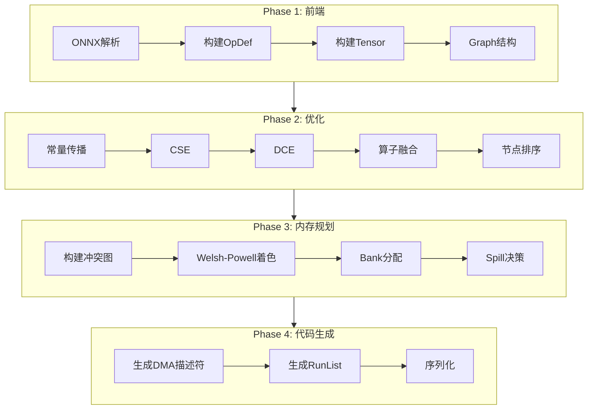

### 1.4 关键设计权衡

图编译器设计面临多重权衡。内存复用vs计算并行：激进的内存复用可能引入数据依赖，限制并行执行。例如，两个独立的计算分支如果复用同一块内存，就必须串行执行。算子融合vs代码膨胀：过度融合导致kernel代码过大，指令缓存失效，反而降低性能。VTCM驻留vsDDR spill：张量在VTCM可获得高带宽，但容量受限迫使部分张量驻留DDR，通过DMA搬运引入延迟。

编译器通过cost model量化这些权衡。每个优化决策都估算对执行时间的影响，选择全局最优解。Cost model可以基于静态启发式，也可以通过profiling收集实际硬件性能数据构建。静态cost model快速但精度有限；动态cost model精确但收集成本高。实际编译器通常结合两者，静态model用于编译期快速决策，动态model用于关键路径的精细调优。

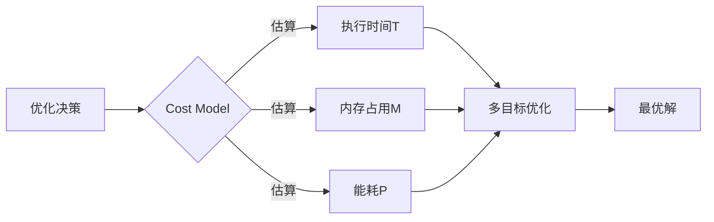

### 1.5 本文结构

本文基于高通Hexagon NPU编译器（libHtpPrepare.so）的反编译分析，深入剖析图编译器的实现原理。第2节介绍图IR的核心数据结构；第3节详解八阶段优化pipeline；第4节阐述CBS内存规划算法；第5节分析DMA spill/fill设计；第6节描述序列化格式；第7节总结执行模型；第8节讨论实现技术细节；第9节展望前沿研究方向。

---

## 2. 图IR核心数据结构

### 2.1 OpDef：算子定义

OpDef是图编译器中表示单个算子的核心结构。反编译分析揭示其内存布局约256字节，包含算子的完整元数据。关键字段包括：操作类型标识（MatMul、Conv、Softmax等）、输入输出张量指针数组、量化参数、VTCM迁移标记、执行优先级。

操作类型字段（+0x08偏移）使用整数枚举。MatMul=0、RMSNorm=1、GELU=2等预定义值使编译器快速识别算子类别。输入输出字段（+0x10和+0x30偏移）存储std::vector<Tensor*>，支持变长输入输出。这一设计适应融合算子如"MatMul+Bias+ReLU"的多输入场景。融合算子的输入可能来自多个前驱算子，输出可能被多个后继算子消费，变长数组灵活支持这种复杂连接。

```cpp
// OpDef结构伪代码
struct OpDef {
    // 基础字段 (+0x04 - +0x20)
    uint8_t  flags;              // +0x04: bit 0x40=migrated
    uint32_t op_type;            // +0x08: MatMul=0, RMSNorm=1, ...
    uint32_t sub_type;           // +0x0c
    std::vector<Tensor*> inputs;  // +0x10
    uint64_t phase_id;           // +0x28
    std::vector<Tensor*> outputs; // +0x30
    
    // 量化字段 (+0x48 - +0x60)
    uint32_t quant_count;        // +0x48
    void*    quant_array;        // +0x50
    
    // TCM迁移标记 (+0x5d - +0x5f)
    uint8_t  crouton_from_vtcm;  // +0x5d
    uint8_t  crouton_to_vtcm;   // +0x5f
    
    // 元数据 (+0x68 - +0x98)
    uint64_t tag_bitmap;         // +0x68
    uint32_t priority;           // +0x98
};
```

量化参数字段（+0x48 quant_count和+0x50 quant_array）支持混合精度推理。Q8_0权重使用每块32元素的scale量化，Q4_0进一步压缩到4-bit。编译器利用这些参数在融合时正确传播量化信息，避免反复反量化的精度损失。量化参数的传播是编译器优化的关键：当两个量化的算子融合时，编译器需要计算融合后输出的量化参数，而不是简单地将中间结果反量化再量化。

VTCM迁移标记（+0x5d crouton_from_vtcm和+0x5f crouton_to_vtcm）是TCM-aware优化的关键。标记为from_vtcm的输入预期已在VTCM中；标记为to_vtcm的输出将驻留VTCM供后续算子消费。这些标记指导内存规划器分配bank。迁移标记的设置是渐进的：初始所有张量标记为DDR，随着优化进行，热点张量逐步标记为VTCM，直到预算耗尽。

优先级字段（+0x98）用于TcmMigration阶段的堆排序。值越大表示该算子越重要，其输出张量应优先保留在VTCM。FlashAttention等热点算子获得高优先级，避免被spill到DDR。优先级的计算可以基于多种因素：算子的计算复杂度、张量的访问频率、数据局部性等。简单的优先级模型可能只考虑张量大小，而复杂的模型可能结合profiling数据。

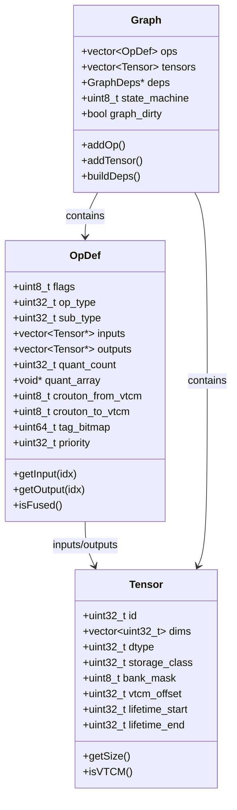

### 2.2 Tensor：张量描述

Tensor结构描述张量的形状、数据类型、存储位置、生命周期等属性。与运行时的实际数据分离，Tensor只包含元数据，实际数据存储在DDR或VTCM中，通过指针或偏移引用。

存储类别（storage_class）字段决定张量物理位置。DDR=0表示驻留外部内存，容量大但带宽有限；VTCM=1表示驻留片上内存，访问延迟低但需要规划；CONST=2表示常量权重，可只读缓存。存储类别的选择是编译器的核心决策之一，直接影响执行性能。

Bank掩码（bank_mask）是VTCM分配的核心。8位掩码表示该张量占用的VTCM bank。bit0=1表示使用bank0，bit1=1表示使用bank1，依此类推。同一时刻活跃的张量如果生命周期重叠，必须分配不同bank。Bank掩码的初始值为0，表示未分配。CBS阶段计算后，每个活跃张量获得非零的bank掩码。

生命周期字段（lifetime_start和lifetime_end）记录张量首次产生和最后使用的算子索引。编译器利用这一信息构建冲突图：如果两个张量的生命周期区间重叠，它们不能同时驻留VTCM，必须分配不同bank或spill到DDR。生命周期的计算需要遍历整个图：从生产者算子开始，沿着数据流传播，直到所有消费者都已完成。

```mermaid
graph TD
    subgraph 张量生命周期示例
        T1[Tensor A<br/>lifetime=[0,2]]
        T2[Tensor B<br/>lifetime=[1,3]]
        T3[Tensor C<br/>lifetime=[2,4]]
        
        Op0[Op0] --> T1
        T1 --> Op1
        Op1 --> T2
        T2 --> Op2
        Op2 --> T3
        
        T1 -.冲突.-> T2
    end
```

VTCM偏移（vtcm_offset）是张量在VTCM中的字节偏移。要求2KB对齐，因为VTCM的最小分配粒度是2KB。偏移计算需考虑bank划分：bank0占据0-2MB，bank1占据2-4MB，依此类推。偏移的计算在CBS着色完成后进行，确保同一bank内的张量不重叠。

### 2.3 Graph：计算图

Graph结构是整个IR的顶层容器，包含算子列表、张量列表、依赖关系、状态机等。算子列表（ops）按执行顺序排列，编译器遍历时按此顺序处理。这种顺序性简化了生命周期分析：只需一次遍历即可计算所有张量的生命周期。

状态机字段（+0x45dc state_machine）跟踪图的编译阶段。ERROR=0表示出错；CONSTRUCTION=1是初始状态，正在构建IR；PREPARE=2表示正在执行编译优化；COMPILED=3表示编译完成，可生成执行计划。状态机的严格检查防止非法操作：不能在PREPARE阶段执行序列化，不能在CONSTRUCTION阶段执行优化。

GraphDirty标志（+0x7311）是Fixpoint优化的核心。当任何优化修改图结构（融合算子、消除死代码）时，设置此标志。Fixpoint循环持续执行直到标志清除，确保优化收敛。标志的粒度可以优化：如果只有局部修改，可以只标记部分子图，避免全图重新处理。

依赖图指针（+0x7468 graph_deps）指向CBS阶段构建的冲突图。该图显式编码张量间的生命周期冲突关系，是内存规划的基础数据结构。依赖图的生命周期与Graph绑定：Graph销毁时依赖图自动释放。

### 2.4 GraphDeps：依赖图

GraphDeps是CBS（Constraint-Based Scheduling）阶段的核心数据结构。它编码张量间的冲突关系：如果两个张量生命周期重叠，它们冲突，不能同时驻留VTCM的同一bank。

依赖图通常用邻接矩阵或邻接表表示。邻接矩阵适合稠密冲突，空间复杂度O(n^2)；邻接表适合稀疏冲突，空间复杂度O(n+m)。Hexagon编译器采用位图优化的邻接矩阵，利用张量数量可控（通常数千个）的特点。位图将每行的冲突信息压缩为位序列，64位平台下每64个张量只需1个uint64_t，大幅减少内存占用。

```cpp
// GraphDeps结构伪代码
struct GraphDeps {
    uint32_t num_tensors;
    
    // 位图优化的邻接矩阵
    // conflict_matrix[i][j/64]的第(j%64)位表示tensor_i和tensor_j是否冲突
    std::vector<std::vector<uint64_t>> conflict_matrix;
    
    // 生命周期数组
    std::vector<uint32_t> lifetime_starts;
    std::vector<uint32_t> lifetime_ends;
    
    // CBS分配结果
    std::vector<BlockTableEntry> entries;
    
    // 冲突检查
    bool hasConflict(uint32_t i, uint32_t j) {
        uint64_t mask = 1ULL << (j % 64);
        return conflict_matrix[i][j / 64] & mask;
    }
    
    // 添加冲突
    void addConflict(uint32_t i, uint32_t j) {
        conflict_matrix[i][j / 64] |= (1ULL << (j % 64));
        conflict_matrix[j][i / 64] |= (1ULL << (i % 64));
    }
};
```

生命周期数组（lifetime_starts和lifetime_ends）与Graph中的Tensor字段对应，但在GraphDeps中扁平化为整数数组，便于CBS算法快速访问。这种扁平化是性能优化：CBS算法频繁访问生命周期信息，扁平数组比间接访问Tensor结构更快。

Bank分配结果（entries数组）存储CBS的输出：每个张量的存储决策（bank、偏移、spill标记）。这是后续DMA生成和序列化的输入。分配结果的结构设计为紧凑的数组，每个条目固定大小，支持随机访问。

### 2.5 IR设计哲学

图IR设计遵循分离原则：元数据与实际数据分离，编译器只操作元数据；静态与动态分离，形状信息尽可能静态化；层次化表示，Graph-OpDef-Tensor三级结构清晰。

IR同时服务于编译期和执行期。编译期，IR支持灵活的查询和修改：遍历算子、查找消费者、分析依赖。执行期，IR被序列化为紧凑二进制，加载时快速重建。这种双重用途要求IR设计兼顾灵活性和紧凑性。

IR的可变性经过精心设计。某些字段（如op_type）在构建后不可变；某些字段（如bank_mask）由特定编译阶段计算；某些字段（如vtcm_offset）在序列化后才最终确定。这种不变性保证编译的正确性：如果op_type可变，优化pass可能错误地改变算子类型，导致后续处理出错。

---

## 3. 八阶段优化Pipeline

### 3.1 Fixpoint优化框架

Fixpoint优化是图编译器的核心机制。它反复执行优化pass直到图结构稳定（graph_dirty=false）。每次pass可能修改图，引发新的优化机会。循环继续直到达到不动点——再执行任何pass都不会改变图。

典型的Fixpoint循环包含三个子pass：常量传播与公共子表达式消除（const_prop_and_cse）、死代码消除（remove_dead_code）、节点排序（order_nodes）。前两者简化图结构，后者为后续优化准备良好的遍历顺序。

```cpp
// Fixpoint优化框架伪代码
Status fixpointOptimize(Graph& graph) {
    const int MAX_ITERATIONS = 100;
    int iteration = 0;
    
    do {
        graph.graph_dirty = false;
        
        // Phase 1: 常量传播 + CSE
        Status s = constPropAndCSE(graph);
        if (!s.ok()) return s;
        
        // Phase 2: 死代码消除
        s = removeDeadCode(graph);
        if (!s.ok()) return s;
        
        // Phase 3: 节点排序
        s = orderNodes(graph);
        if (!s.ok()) return s;
        
        iteration++;
        
    } while (graph.graph_dirty && iteration < MAX_ITERATIONS);
    
    if (iteration >= MAX_ITERATIONS) {
        return Status::Error("Fixpoint did not converge");
    }
    
    return Status::OK();
}
```

循环必须设置最大迭代次数（如100次）防止无限循环。虽然理论上优化应该收敛，但实现缺陷可能导致震荡。达到最大迭代次数仍未收敛时，编译器报错或降级处理。

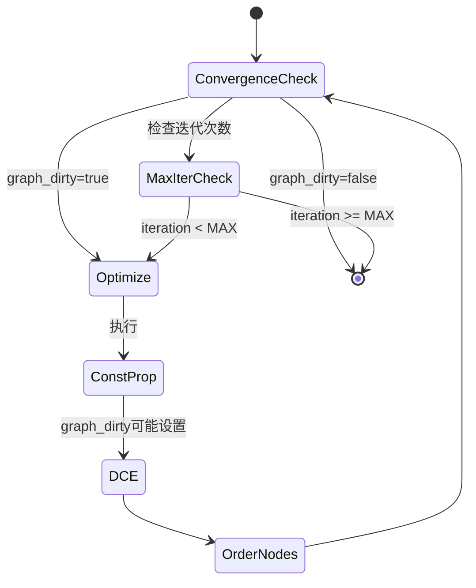

### 3.2 八阶段设计

Hexagon编译器将优化划分为八个阶段，每个阶段有特定的优化目标和阈值。阶段0执行保守的常量折叠；阶段1进行形状归一化；阶段2折叠量化操作；阶段3融合激活函数；阶段4进行TCM-aware重写；阶段5转换数据布局；阶段6执行最后的窥孔优化；阶段7是终端标记。

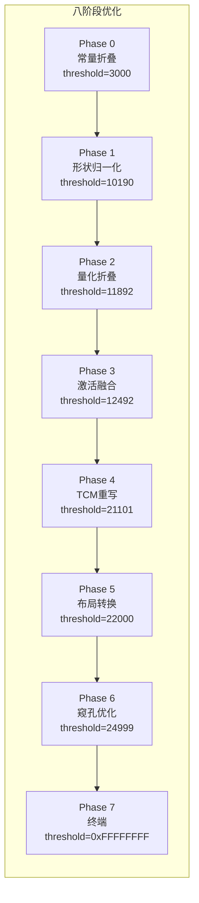

阈值表控制各阶段的激进程度。阶段0阈值3000，只有hash值小于此值的简单模式才被匹配；阶段6阈值24999，几乎所有可识别模式都会被处理。这种渐进式设计确保早期阶段不做可能破坏后续优化的激进变换。

每个阶段内部是Fixpoint子循环。阶段内反复应用该阶段的规则直到收敛，然后进入下一阶段。阶段之间执行完整的DCE和CSE清理，消除上一阶段产生的冗余。

```cpp
// 八阶段优化伪代码
const uint32_t PHASE_THRESHOLDS[8] = {
    0x00000BB8,   // Phase 0: 3000
    0x000027CE,   // Phase 1: 10190
    0x00002E7C,   // Phase 2: 11892
    0x000030D4,   // Phase 3: 12492
    0x0000526D,   // Phase 4: 21101
    0x000055F0,   // Phase 5: 22000
    0x000061A7,   // Phase 6: 24999
    0xFFFFFFFF    // Phase 7: Terminal
};

Status runOptimizePasses(Graph& graph) {
    for (int phase = 0; phase < 8; phase++) {
        uint32_t threshold = PHASE_THRESHOLDS[phase];
        
        bool phase_dirty = true;
        int phase_iter = 0;
        
        while (phase_dirty && phase_iter < 100) {
            phase_dirty = false;
            
            // 应用当前阶段的融合规则
            for (auto& rule : fusion_rules[phase]) {
                if (applyFusionRule(graph, rule, threshold)) {
                    phase_dirty = true;
                    graph.graph_dirty = true;
                }
            }
            
            if (phase_dirty) {
                // 重新排序节点
                orderNodes(graph, false);
            }
            
            phase_iter++;
        }
        
        // 阶段后清理
        removeDeadCode(graph, false);
        commonSubexprEliminate(graph, false);
    }
    
    return Status::OK();
}
```

### 3.3 Fibonacci Hash模式匹配

模式匹配是算子融合的基础。编译器需要识别特定算子组合（如Conv+BN+ReLU）并替换为融合算子（ConvBNReLU）。高效的模式匹配对编译速度至关重要。

Hexagon编译器使用Fibonacci hash进行模式识别。两个乘数0x192e2101和0x740f1de9将算子名称字符串映射为32位hash值。hash计算为迭代乘加：hash = hash * mult + *str++。

```cpp
// Fibonacci Hash实现
const uint32_t FIB_MULT_1 = 0x192e2101;
const uint32_t FIB_MULT_2 = 0x740f1de9;

uint32_t fibonacciHash(const char* str, uint32_t mult) {
    uint32_t hash = 0;
    while (*str) {
        hash = hash * mult + static_cast<uint8_t>(*str);
        str++;
    }
    return hash;
}

// 模式匹配示例
bool matchFusionPattern(OpDef* op, const FusionPattern& pattern, uint32_t threshold) {
    // 计算hash并与阈值比较
    uint32_t hash = fibonacciHash(op->name, pattern.hash_seed);
    
    // 快速筛选：hash >= threshold则不匹配
    if (hash >= threshold) {
        return false;
    }
    
    // 详细匹配：检查算子类型、输入输出等
    return detailedMatch(op, pattern);
}
```

这种hash具有类似Fibonacci数列的分布特性，碰撞概率低。与标准库hash不同，Fibonacci hash是可移植的，不依赖具体实现。这确保不同编译器版本生成的hash一致，行为可预测。

阈值机制配合hash实现快速筛选。计算待匹配算子的hash，与阶段阈值比较。只有hash小于阈值时才执行完整模式匹配，大幅减少字符串比较开销。

### 3.4 常量传播与CSE

常量传播（Constant Propagation）识别全输入为常量的算子，在编译期计算结果并替换为常量张量。例如Shape算子如果输入形状已知，可直接计算出形状值。

传播算法正向遍历图：标记常量张量（无生产者或生产者is_const）；检查消费者是否所有输入都已标记常量；如果是，折叠该算子；将输出标记为新常量；循环直到无新常量产生。

```cpp
// 常量传播伪代码
Status constantPropagation(Graph& graph) {
    std::set<uint32_t> constants;
    bool changed = true;
    
    while (changed) {
        changed = false;
        
        // 识别常量张量
        for (auto& tensor : graph.tensors) {
            if (tensor.producers.empty() || 
                (tensor.producers.size() == 1 && 
                 graph.ops[tensor.producers[0]].is_const)) {
                constants.insert(tensor.id);
            }
        }
        
        // 尝试折叠消费者
        for (auto& op : graph.ops) {
            bool all_inputs_const = true;
            for (auto& input : op.inputs) {
                if (!constants.count(input->id)) {
                    all_inputs_const = false;
                    break;
                }
            }
            
            if (all_inputs_const && !op.inputs.empty() && !op.is_const) {
                // 执行常量折叠
                auto folded = foldConstantOp(op);
                if (folded.ok()) {
                    replaceOpWithConstant(graph, op, folded.value());
                    constants.insert(op.outputs[0]->id);
                    changed = true;
                    graph.graph_dirty = true;
                }
            }
        }
    }
    
    return Status::OK();
}
```

公共子表达式消除（CSE）识别计算相同值的多个算子，只保留一个，其他替换为对该结果的引用。判断"相同"需要比较算子类型、输入张量ID、属性参数。

CSE使用哈希表加速查找。算子签名（类型+输入ID+属性hash）作为key，算子ID作为value。遇到新算子时先查表，存在则替换引用，不存在则插入表。

### 3.5 死代码消除

死代码消除（DCE）删除对最终输出无贡献的算子和张量。它以图的输出为起点反向BFS，标记所有可达节点，删除未标记节点。

反向BFS的原因是数据流方向与依赖方向相反。输出张量依赖其生产者，生产者又依赖输入。反向遍历自然跟随依赖链。

```cpp
// 死代码消除伪代码
Status removeDeadCode(Graph& graph) {
    std::set<uint32_t> reachable;
    std::queue<uint32_t> worklist;
    
    // 从输出张量开始
    for (auto& tensor : graph.tensors) {
        if (tensor.is_output) {
            worklist.push(tensor.id);
        }
    }
    
    // 反向BFS
    while (!worklist.empty()) {
        uint32_t tid = worklist.front();
        worklist.pop();
        
        if (reachable.count(tid)) continue;
        reachable.insert(tid);
        
        // 找到生产者
        for (auto& op : graph.ops) {
            for (auto& output : op.outputs) {
                if (output->id == tid) {
                    // 标记该op的所有输入
                    for (auto& input : op.inputs) {
                        worklist.push(input->id);
                    }
                    break;
                }
            }
        }
    }
    
    // 删除不可达节点
    auto it = graph.ops.begin();
    while (it != graph.ops.end()) {
        bool op_reachable = false;
        for (auto& output : it->outputs) {
            if (reachable.count(output->id)) {
                op_reachable = true;
                break;
            }
        }
        
        if (!op_reachable && !it->has_side_effect) {
            it = graph.ops.erase(it);
            graph.graph_dirty = true;
        } else {
            ++it;
        }
    }
    
    return Status::OK();
}
```

副作用算子（如打印、断言）即使输出不被使用也必须保留。DCE需要识别这些特殊算子，将其视为隐式输出起点。

### 3.6 算子融合规则

算子融合将多个连续算子合并为单一融合算子，消除中间结果的存储和加载。融合规则定义匹配模式和重写动作。

规则结构包含：名称（如"ConvBNReLU"）、模式（[Conv, BN, ReLU]列表）、条件函数（检查Conv的输出是否唯一被BN消费）、重写函数（创建ConvBNReLU算子，调整边）。

```cpp
// 融合规则定义
struct FusionRule {
    std::string name;
    std::vector<std::string> pattern;  // 例如: ["MatMul", "Add"]
    std::string fused_op_name;
    uint32_t phase;
    uint32_t hash_seed;
    
    // 条件函数：检查是否可以融合
    std::function<bool(const Graph&, const std::vector<OpDef*>&)> condition;
    
    // 重写函数：执行融合
    std::function<Status(Graph&, const std::vector<OpDef*>&)> rewrite;
};

// 预定义融合规则
std::vector<FusionRule> FUSION_RULES = {
    // MatMul + BiasAdd + ReLU -> MatMulBiasReLU
    {
        "MatMulBiasReLU",
        {"MatMul", "BiasAdd", "ReLU"},
        "MatMulBiasReLU",
        3,  // Phase 3
        FIB_MULT_1,
        [](auto& g, auto& ops) {
            // 检查BiasAdd的输入是MatMul的输出
            return isSingleConsumer(g, ops[0], ops[1]) &&
                   isSingleConsumer(g, ops[1], ops[2]);
        },
        [](auto& g, auto& ops) {
            return fuseOps(g, ops, "MatMulBiasReLU");
        }
    },
    
    // RMSNorm + MatMul -> RMSNormMatMul
    {
        "RMSNormMatMul",
        {"RMSNorm", "MatMul"},
        "RMSNormMatMul",
        4,  // Phase 4
        FIB_MULT_2,
        [](auto& g, auto& ops) {
            return isSingleConsumer(g, ops[0], ops[1]) &&
                   fitsInVTCM(ops[0].outputs[0]);
        },
        [](auto& g, auto& ops) {
            return fuseOps(g, ops, "RMSNormMatMul");
        }
    }
};
```

融合分层次进行。层内融合合并同一层的MatMul+Bias+ReLU；跨层融合合并相邻层的Reshape+Transpose。层次化降低匹配复杂度。

TCM-aware融合考虑内存约束。RMSNorm+MatMul的融合不仅消除中间结果，还使RMSNorm的输出直接驻留VTCM供MatMul消费，避免DDR往返。

### 3.7 节点排序

节点排序决定算子的执行顺序。良好的排序提升缓存局部性，使张量产生后尽快被消费，缩短生命周期，降低内存占用。

拓扑排序是基础约束：算子必须在所有输入就绪后执行。Kahn算法是标准实现：计算每个节点的入度，将入度为零的节点加入队列，依次处理并减少后继节点入度。

```cpp
// 节点排序伪代码
Status orderNodes(Graph& graph) {
    // 计算入度
    std::map<uint32_t, int> in_degree;
    for (auto& op : graph.ops) {
        in_degree[op.id] = 0;
    }
    for (auto& op : graph.ops) {
        for (auto& input : op.inputs) {
            for (auto& producer : input->producers) {
                in_degree[op.id]++;
            }
        }
    }
    
    // 优先队列：关键路径优先 + 内存优先
    auto cmp = [&graph](uint32_t a, uint32_t b) {
        // 关键路径长度
        int cp_a = criticalPathLength(graph, a);
        int cp_b = criticalPathLength(graph, b);
        if (cp_a != cp_b) return cp_a < cp_b;
        
        // 内存局部性
        int mem_a = memoryLocalityScore(graph, a);
        int mem_b = memoryLocalityScore(graph, b);
        return mem_a < mem_b;
    };
    
    std::priority_queue<uint32_t, std::vector<uint32_t>, decltype(cmp)> ready(cmp);
    
    // 初始化：入度为0的节点
    for (auto& [id, degree] : in_degree) {
        if (degree == 0) {
            ready.push(id);
        }
    }
    
    // Kahn算法
    std::vector<uint32_t> new_order;
    while (!ready.empty()) {
        uint32_t op_id = ready.top();
        ready.pop();
        new_order.push_back(op_id);
        
        // 更新入度
        for (auto& output : graph.ops[op_id].outputs) {
            for (auto& consumer : output->consumers) {
                in_degree[consumer]--;
                if (in_degree[consumer] == 0) {
                    ready.push(consumer);
                }
            }
        }
    }
    
    // 检查环
    if (new_order.size() != graph.ops.size()) {
        return Status::Error("Cycle detected in graph");
    }
    
    // 应用新顺序
    reorderOps(graph, new_order);
    
    return Status::OK();
}
```

启发式优化在拓扑排序基础上调整顺序。关键路径优先调度最长数据依赖链上的节点；内存优先调度使张量生命周期短的节点优先，快速释放内存。

### 3.8 Size Blowup防护

激进优化可能导致中间张量膨胀。例如Reshape+Transpose在某些形状组合下会产生巨大的中间表示。Size blowup guard监控张量大小变化，超过阈值时拒绝优化。

防护阈值存储在Graph的+0x6244偏移（size_blowup_guard字段）。当新张量大小超过旧张量乘以该阈值时，优化被拒绝。典型值1.5-2.0。

```cpp
// Size Blowup检查
bool checkSizeBlowup(Graph& graph, size_t new_size, size_t old_size) {
    float blowup_ratio = static_cast<float>(new_size) / static_cast<float>(old_size);
    float guard_threshold = graph.size_blowup_guard;  // 通常1.5-2.0
    
    if (blowup_ratio > guard_threshold) {
        log(WARNING, "Size blowup detected: %.2f > %.2f", 
            blowup_ratio, guard_threshold);
        return false;
    }
    return true;
}
```

这种防护对内存受限的嵌入式部署尤其重要。编译器宁可保守也不冒险生成OOM的执行计划。

---

## 4. CBS内存规划算法

### 4.1 问题建模

CBS（Constraint-Based Scheduling）将VTCM分配建模为图着色问题。节点表示张量，边表示生命周期冲突（不能同时驻留VTCM），颜色表示VTCM bank（8种），目标是最小化spill（溢出到DDR）的张量数量。

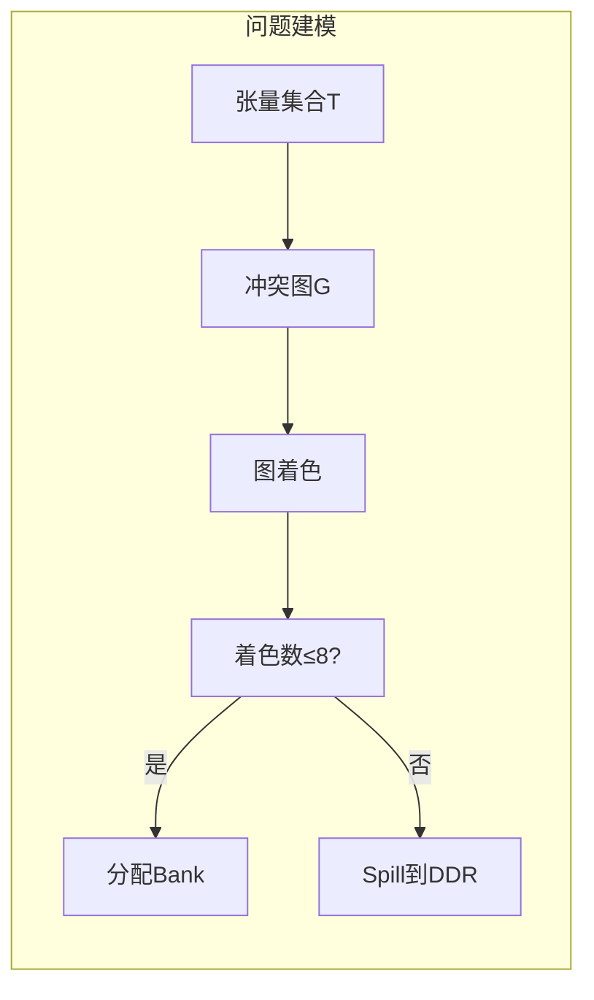

图着色是NP完全问题，精确求解计算不可行。编译器采用贪心启发式算法Welsh-Powell，在可接受时间内获得近似最优解。

问题输入包括：张量列表（含大小、生命周期）、VTCM总容量（通常16MB）、bank数量（8个）、对齐要求（2KB）。输出是每个张量的存储决策：驻留哪个bank或spill到DDR。

**组合数学背景**：图着色问题在计算复杂性理论中是经典的NP完全问题。对于一般图，确定其色数（chromatic number）是NP难问题。Welsh-Powell算法是一种贪心近似算法，其近似比在最坏情况下可以达到Δ+1，其中Δ是图的最大度数。对于VTCM分配问题，由于有固定的颜色数（8个bank），算法的输出要么是一个合法着色，要么是一个spill决策。

### 4.2 冲突图构建

冲突图构建是CBS的第一阶段。算法遍历所有张量对，检查生命周期是否重叠。重叠则添加冲突边。

生命周期表示为[start, end]闭区间。两区间重叠当且仅当：

$$\text{overlap}(i, j) = [start_i \leq end_j] \land [start_j \leq end_i]$$

边界情况（end1==start2）认为重叠，因为产生和消费可能同一周期。

```cpp
// 冲突图构建伪代码
Status buildConflictGraph(Graph& graph, GraphDeps& deps) {
    deps.num_tensors = graph.tensors.size();
    
    // 初始化邻接矩阵（位图）
    size_t words_per_row = (deps.num_tensors + 63) / 64;
    deps.conflict_matrix.resize(deps.num_tensors, 
        std::vector<uint64_t>(words_per_row, 0));
    
    // 填充生命周期数组
    deps.lifetime_starts.resize(deps.num_tensors);
    deps.lifetime_ends.resize(deps.num_tensors);
    
    for (size_t i = 0; i < deps.num_tensors; i++) {
        deps.lifetime_starts[i] = graph.tensors[i].lifetime_start;
        deps.lifetime_ends[i] = graph.tensors[i].lifetime_end;
    }
    
    // 构建冲突边
    for (size_t i = 0; i < deps.num_tensors; i++) {
        for (size_t j = i + 1; j < deps.num_tensors; j++) {
            // 检查生命周期重叠
            bool overlap = !(deps.lifetime_ends[i] < deps.lifetime_starts[j] ||
                           deps.lifetime_ends[j] < deps.lifetime_starts[i]);
            
            if (overlap) {
                deps.addConflict(i, j);
            }
        }
    }
    
    return Status::OK();
}
```

冲突图通常稀疏。实际神经网络中，多数张量只在局部层内活跃，跨层张量较少。稀疏性可用邻接表高效表示。

### 4.3 Welsh-Powell着色

Welsh-Powell算法按度降序排序节点，高度数节点优先着色。高度数节点有更多约束，优先着色确保获得可用颜色。

**算法复杂度分析**：
- 排序阶段：O(n log n)，n为张量数
- 着色阶段：O(n * d)，d为平均度数
- 总体：O(n^2)最坏情况，但通常d << n

排序后遍历节点。对每个节点，收集所有邻居的颜色（已着色邻居），选择最小未使用颜色（0-7）。如果8种颜色都被邻居使用，标记为spill（颜色=8）。

```cpp
// Welsh-Powell着色伪代码
Status welshPowellColoring(GraphDeps& deps, uint32_t num_banks) {
    struct CbsNode {
        uint32_t tensor_id;
        uint32_t color;      // 0-7=banks, 8=spill
        uint32_t degree;
    };
    
    std::vector<CbsNode> nodes(deps.num_tensors);
    
    // 初始化节点
    for (size_t i = 0; i < deps.num_tensors; i++) {
        nodes[i].tensor_id = i;
        nodes[i].color = 8;  // 默认spill
        
        // 计算度数（冲突数）
        nodes[i].degree = 0;
        for (size_t j = 0; j < deps.num_tensors; j++) {
            if (i != j && deps.hasConflict(i, j)) {
                nodes[i].degree++;
            }
        }
    }
    
    // 按度数降序排序
    std::sort(nodes.begin(), nodes.end(),
        [](const CbsNode& a, const CbsNode& b) {
            return a.degree > b.degree;
        });
    
    // 贪心着色
    for (auto& node : nodes) {
        uint32_t tid = node.tensor_id;
        
        // 标记邻居已用颜色
        bool used[8] = {false};
        for (size_t j = 0; j < deps.num_tensors; j++) {
            if (deps.hasConflict(tid, j) && deps.entries[j].color < 8) {
                used[deps.entries[j].color] = true;
            }
        }
        
        // 找第一个可用颜色
        bool colored = false;
        for (uint32_t c = 0; c < num_banks; c++) {
            if (!used[c]) {
                node.color = c;
                deps.entries[tid].color = c;
                deps.entries[tid].bank_mask = (1 << c);
                deps.entries[tid].storage_class = VTCM_PERSISTENT;
                colored = true;
                break;
            }
        }
        
        // 无可用颜色 -> spill
        if (!colored) {
            node.color = 8;
            deps.entries[tid].color = 8;
            deps.entries[tid].storage_class = DDR;
            deps.entries[tid].bank_mask = 0;
        }
    }
    
    return Status::OK();
}
```

贪心策略不保证最优，但实践中表现良好。spill数量通常不到总张量的10%，对性能影响可控。

### 4.4 3/4 VTCM预算策略

VTCM预算采用保守的3/4策略。总容量16MB，预算12MB，保留4MB作为spill缓冲区。这一策略防止VTCM过度使用导致的性能抖动。

$$\text{Budget} = \frac{3}{4} \times \text{TotalVTCM}$$

预算检查在着色后执行。计算每个bank的使用量（该bank所有分配张量的对齐大小之和），如果任bank超过budget/8，触发spill调整。

```cpp
// 预算检查与调整
Status checkAndAdjustBudget(GraphDeps& deps, uint32_t vtcm_size) {
    uint32_t budget = (vtcm_size * 3) / 4;  // 3/4策略
    uint32_t bank_budget = budget / 8;
    
    // 计算每个bank的使用量
    uint32_t bank_usage[8] = {0};
    for (size_t i = 0; i < deps.num_tensors; i++) {
        if (deps.entries[i].storage_class == VTCM_PERSISTENT) {
            uint32_t color = deps.entries[i].color;
            uint32_t aligned_size = alignUp(deps.entries[i].size, 2048);
            bank_usage[color] += aligned_size;
        }
    }
    
    // 检查是否超出预算
    for (int bank = 0; bank < 8; bank++) {
        if (bank_usage[bank] > bank_budget) {
            // 溢出：需要spill一些张量
            uint32_t excess = bank_usage[bank] - bank_budget;
            
            // 按优先级排序该bank的张量
            std::vector<uint32_t> bank_tensors;
            for (size_t i = 0; i < deps.num_tensors; i++) {
                if (deps.entries[i].color == bank) {
                    bank_tensors.push_back(i);
                }
            }
            
            std::sort(bank_tensors.begin(), bank_tensors.end(),
                [&deps](uint32_t a, uint32_t b) {
                    return deps.entries[a].priority < deps.entries[b].priority;
                });
            
            // Spill低优先级张量
            for (auto tid : bank_tensors) {
                if (excess == 0) break;
                
                deps.entries[tid].storage_class = DDR;
                deps.entries[tid].color = 8;
                deps.entries[tid].bank_mask = 0;
                excess -= alignUp(deps.entries[tid].size, 2048);
            }
        }
    }
    
    return Status::OK();
}
```

调整策略：按优先级排序张量（priority字段），低优先级优先spill，直到预算满足。优先级来自 profiling 或静态估计（如MatMul输出优先级高于Reshape输出）。

### 4.5 双种子重试机制

CBS支持重试机制。初始着色spill过多时，调整策略重新着色，最多3次重试。

双种子阈值生成调整策略：

$$\text{threshold}_k = s_1 \cdot k + s_2 \cdot k^2$$

其中$s_1 = 1.3$，$s_2 = 1.4$，$k$为重试次数。

```cpp
// 双种子重试机制
Status cbsWithRetry(Graph& graph, GraphDeps& deps, int max_retries = 3) {
    const double SEED_1 = 1.3;
    const double SEED_2 = 1.4;
    
    for (int retry = 0; retry < max_retries; retry++) {
        // 执行着色
        welshPowellColoring(deps, 8);
        
        // 统计spill数量
        int spill_count = 0;
        for (auto& entry : deps.entries) {
            if (entry.color == 8) spill_count++;
        }
        
        // 检查是否可接受
        if (spill_count == 0) {
            break;  // 完美着色
        } else if (spill_count < 10) {
            break;  // 可接受的spill数量
        }
        
        // 需要重试：调整策略
        log(WARNING, "CBS retry %d: spill_count=%d", retry, spill_count);
        
        // 计算阈值
        double threshold = SEED_1 * retry + SEED_2 * retry * retry;
        
        // 标记大tensor优先spill
        for (size_t i = 0; i < deps.num_tensors; i++) {
            if (deps.entries[i].size > threshold) {
                deps.entries[i].priority = 0;  // 低优先级
            }
        }
    }
    
    return Status::OK();
}
```

这一机制在密集图中有效。第一次重试spill大张量释放空间；第二次进一步spill；第三次达到可接受的分配。

### 4.6 Bank分配与偏移计算

着色完成后，已知每个张量驻留哪个bank。接下来计算bank内的具体偏移。

每个bank独立分配。按张量大小降序排列该bank的所有张量，大者优先分配到低地址。这一策略减少碎片。

偏移对齐到2KB：

$$\text{offset} = (\text{prev_offset} + \text{size} + 2047) \ \& \ \sim2047$$

```cpp
// Bank偏移计算
Status computeBankOffsets(GraphDeps& deps, uint32_t vtcm_size) {
    uint32_t bank_size = vtcm_size / 8;
    
    for (int bank = 0; bank < 8; bank++) {
        // 收集该bank的所有tensor
        std::vector<uint32_t> bank_tensors;
        for (size_t i = 0; i < deps.num_tensors; i++) {
            if (deps.entries[i].color == bank) {
                bank_tensors.push_back(i);
            }
        }
        
        // 按大小降序排序
        std::sort(bank_tensors.begin(), bank_tensors.end(),
            [&deps](uint32_t a, uint32_t b) {
                return deps.entries[a].size > deps.entries[b].size;
            });
        
        // 分配偏移
        uint32_t current_offset = 0;
        for (auto tid : bank_tensors) {
            uint32_t aligned_size = alignUp(deps.entries[tid].size, 2048);
            
            deps.entries[tid].vtcm_offset = bank * bank_size + current_offset;
            deps.entries[tid].vtcm_offset &= ~0x7FF;  // 2KB对齐
            
            current_offset += aligned_size;
        }
    }
    
    return Status::OK();
}
```

对齐满足VTCM硬件要求，也简化DMA地址计算。

### 4.7 Spill决策与DMA生成

被标记为spill的张量（颜色=8）不分配VTCM，而是分配DDR空间。但其消费者在VTCM执行，需要在消费前通过DMA fill从DDR加载。

Spill决策记录：张量ID、fill时机（首次消费前）、spill时机（最后生产后）。时机以算子索引表示。

```cpp
// DMA生成
Status generateDMADescriptors(Graph& graph, GraphDeps& deps, 
                                std::vector<PortableDMA>& dmas) {
    for (size_t i = 0; i < deps.num_tensors; i++) {
        if (deps.entries[i].storage_class == DDR) {
            // 需要fill（DDR -> VTCM）
            uint32_t fill_op = deps.lifetime_starts[i];
            PortableDMA fill_desc;
            fill_desc.src_ptr = deps.entries[i].ddr_offset;
            fill_desc.dst_ptr = deps.entries[i].vtcm_offset;
            fill_desc.size = alignUp(deps.entries[i].size, 128);
            fill_desc.flags = DMA_MODE_FILL;
            fill_desc.synctoken_id = allocateSynctoken();
            dmas.push_back(fill_desc);
            
            // 需要spill（VTCM -> DDR）
            uint32_t spill_op = deps.lifetime_ends[i];
            PortableDMA spill_desc;
            spill_desc.src_ptr = deps.entries[i].vtcm_offset;
            spill_desc.dst_ptr = deps.entries[i].ddr_offset;
            spill_desc.size = alignUp(deps.entries[i].size, 128);
            spill_desc.flags = DMA_MODE_SPILL;
            spill_desc.synctoken_id = allocateSynctoken();
            dmas.push_back(spill_desc);
        }
    }
    
    return Status::OK();
}
```

Fill和spill可能成对出现：张量被产生时spill到DDR，被消费时fill回VTCM。如果生产者和消费者都在VTCM，但中间张量太大无法常驻，使用double buffering：BufA计算时DMA加载BufB。

### 4.8 多NSP分配

多NSP（Neural Signal Processor）系统需要跨核分配张量。每个NSP有自己的VTCM bank子集。

分配策略：将8个bank均分给num_nsps个NSP。NSP0使用bank0-1，NSP1使用bank2-3，依此类推。张量根据消费者所在NSP决定归属。

```cpp
// 多NSP分配
Status distributeToNSPs(Graph& graph, GraphDeps& deps, uint32_t num_nsps) {
    uint32_t banks_per_nsp = 8 / num_nsps;
    
    for (uint32_t nsp = 0; nsp < num_nsps; nsp++) {
        uint32_t bank_start = nsp * banks_per_nsp;
        uint32_t bank_end = bank_start + banks_per_nsp;
        
        // 为当前NSP分配tensor
        for (size_t i = 0; i < deps.num_tensors; i++) {
            uint8_t mask = deps.entries[i].bank_mask;
            for (int b = bank_start; b < bank_end; b++) {
                if (mask & (1 << b)) {
                    deps.entries[i].nsp_id = nsp;
                    break;
                }
            }
        }
    }
    
    return Status::OK();
}
```

跨NSP张量（被多个NSP消费）需要特殊处理。复制到每个NSP的VTCM，或通过共享内存访问。实际部署中尽量避免此类张量。

### 4.9 冲突验证

CBS最后验证分配结果的正确性。检查同一bank内所有张量对，确保生命周期不重叠。如果发现冲突，报错或触发重试。

```cpp
// 冲突验证
Status verifyNoConflicts(GraphDeps& deps) {
    for (size_t i = 0; i < deps.num_tensors; i++) {
        for (size_t j = i + 1; j < deps.num_tensors; j++) {
            // 检查是否在同一bank
            if ((deps.entries[i].bank_mask & deps.entries[j].bank_mask) != 0) {
                // 检查生命周期是否重叠
                bool overlap = !(deps.lifetime_ends[i] < deps.lifetime_starts[j] ||
                               deps.lifetime_ends[j] < deps.lifetime_starts[i]);
                
                if (overlap) {
                    return Status::Error("Bank conflict detected: %zu and %zu", i, j);
                }
            }
        }
    }
    
    return Status::OK();
}
```

验证是安全网。贪心算法理论上不会产生冲突，但实现缺陷或边界条件可能导致。验证确保生成正确的执行计划。

---

## 5. DMA Spill/Fill设计

### 5.1 DMA引擎概述

DMA（Direct Memory Access）引擎在后台搬运数据，不占用CPU/DSP计算单元。Hexagon NPU使用专用DMA硬件处理DDR-VTCM数据传输。

DMA操作以描述符链形式提交。每个描述符包含：源地址、目标地址、传输大小、步幅（支持2D传输）、同步标记ID。描述符可以链式执行，前一个完成后自动触发下一个。

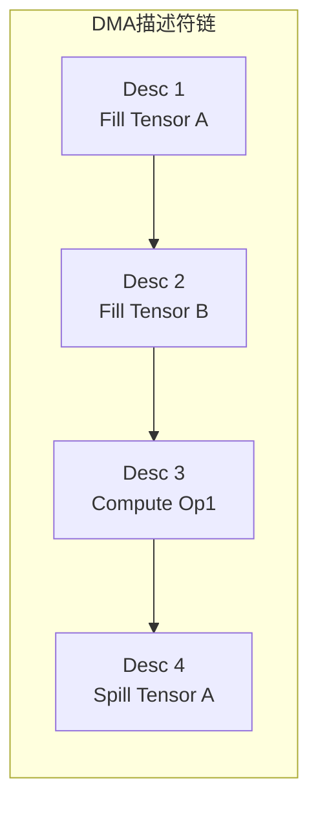

Fill操作方向DDR→VTCM，将权重或激活从外部内存加载到片上内存。Spill操作方向VTCM→DDR，将不活跃的激活保存到外部内存释放VTCM。

### 5.2 DMA描述符结构

PortableDMA结构（约64字节）是DMA操作的标准表示。

```cpp
// DMA描述符结构
struct PortableDMA {
    uint64_t src_ptr;        // 源地址（DDR或VTCM偏移）
    uint64_t dst_ptr;        // 目标地址
    uint32_t size;           // 传输字节数
    uint16_t flags;          // 1D/2D模式等
    uint16_t config;         // 优先级等配置
    uint32_t synctoken_id;   // 同步标记ID
    
    // 2D传输专用
    uint32_t src_stride;     // 源行间距
    uint32_t dst_stride;     // 目标行间距
    uint32_t width;          // 行宽
    uint32_t height;         // 行数
};

// DMA模式标志
const uint16_t DMA_MODE_1D = 0x0000;
const uint16_t DMA_MODE_2D = 0x0001;
const uint16_t DMA_MODE_FILL = 0x0010;   // DDR -> VTCM
const uint16_t DMA_MODE_SPILL = 0x0020;  // VTCM -> DDR
const uint16_t DMA_PRIORITY_HIGH = 0x0100;
```

Synctoken是异步执行的关键。提交DMA时分配唯一synctoken，硬件完成传输后设置该标记。软件轮询或等待synctoken得知完成，然后继续执行。

2D传输支持strided数据。src_stride和dst_stride指定行间距，width和height指定行宽和行数。这高效支持图像和特征图的传输，无需flatten。

### 5.3 Fill策略

Fill在数据需要前执行。消费者算子执行前，检查输入是否已在VTCM。如果输入标记为spill（驻留DDR），生成fill描述符预加载。

Prefetch策略可以隐藏延迟。在计算当前tile时，DMA预加载下一个tile的数据。计算与传输重叠，总时间=max(计算时间,传输时间)而非两者之和。

```cpp
// Fill策略实现
Status insertFillOperations(Graph& graph, GraphDeps& deps) {
    for (auto& op : graph.ops) {
        for (auto& input : op.inputs) {
            uint32_t tid = input->id;
            
            // 检查是否需要fill
            if (deps.entries[tid].storage_class == DDR) {
                // 生成fill描述符
                PortableDMA dma;
                dma.src_ptr = deps.entries[tid].ddr_offset;
                dma.dst_ptr = deps.entries[tid].vtcm_offset;
                dma.size = alignUp(deps.entries[tid].size, 128);
                dma.flags = DMA_MODE_FILL | DMA_PRIORITY_HIGH;
                dma.synctoken_id = allocateSynctoken();
                
                // 插入到op之前
                insertBeforeOp(graph, op, dma);
            }
        }
    }
    
    return Status::OK();
}
```

Fill的调度位置影响性能。过早fill占用VTCM，可能挤压其他张量；过迟fill导致计算等待。编译器使用启发式：在消费者前刚好足够时间完成传输的位置插入fill。

### 5.4 Spill策略

Spill在生产者完成后执行。张量不再被后续算子使用时，生成spill描述符将数据移到DDR，释放VTCM供其他张量使用。

Lazy spill策略延迟spill直到VTCM压力迫使。如果VTCM充足，即使张量不再使用也暂留，避免不必要的DMA。压力指标是已分配VTCM与预算的比值。

```cpp
// Spill策略实现
Status insertSpillOperations(Graph& graph, GraphDeps& deps) {
    for (size_t i = 0; i < deps.num_tensors; i++) {
        if (deps.entries[i].storage_class != VTCM_PERSISTENT) {
            continue;
        }
        
        // 检查是否还有后续使用
        uint32_t last_use = deps.lifetime_ends[i];
        bool has_future_use = false;
        
        for (auto& op : graph.ops) {
            if (op.id > last_use) {
                for (auto& input : op.inputs) {
                    if (input->id == i) {
                        has_future_use = true;
                        break;
                    }
                }
            }
        }
        
        // 如果没有后续使用，可以spill
        if (!has_future_use) {
            PortableDMA dma;
            dma.src_ptr = deps.entries[i].vtcm_offset;
            dma.dst_ptr = deps.entries[i].ddr_offset;
            dma.size = alignUp(deps.entries[i].size, 128);
            dma.flags = DMA_MODE_SPILL;
            dma.synctoken_id = allocateSynctoken();
            
            // 在last_use之后插入
            insertAfterOp(graph, graph.ops[last_use], dma);
        }
    }
    
    return Status::OK();
}
```

### 5.5 Double Buffering

Double buffering是hide DMA延迟的经典技术。VTCM划分两个buffer：BufA和BufB。计算使用BufA时，DMA向BufB传输；计算切换到BufB时，DMA向BufA传输。

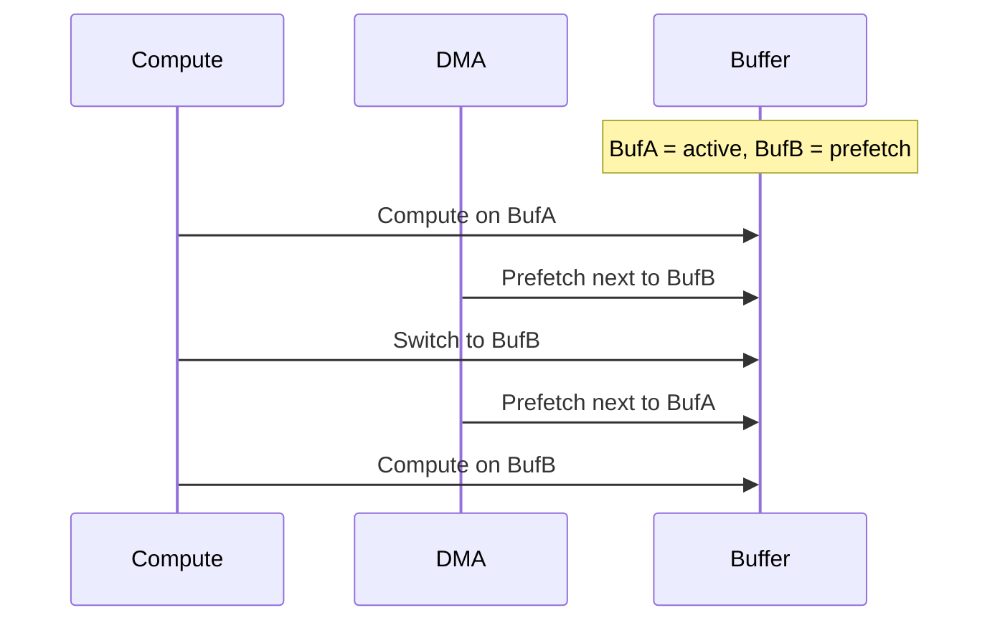

编译器自动识别可double buffer的场景：张量被多次生产消费，且生产消费交替进行。MatMul的权重通常如此：每个token使用相同权重，可以预加载下一token的权重。

Buffer切换由synctoken同步。计算完成设置token，DMA等待该token后启动传输；DMA完成设置另一token，计算等待该token后开始。

```cpp
// Double Buffering实现
Status setupDoubleBuffering(Graph& graph, uint32_t tensor_id, 
                            uint32_t num_iterations) {
    const uint32_t BUF_A = 0;
    const uint32_t BUF_B = 1;
    
    uint32_t compute_synctoken = allocateSynctoken();
    uint32_t dma_synctoken = allocateSynctoken();
    
    for (uint32_t iter = 0; iter < num_iterations; iter++) {
        uint32_t current_buf = (iter % 2 == 0) ? BUF_A : BUF_B;
        uint32_t next_buf = (iter % 2 == 0) ? BUF_B : BUF_A;
        
        // 等待DMA完成（第一次除外）
        if (iter > 0) {
            insertWait(graph, iter, dma_synctoken);
        }
        
        // 计算（使用current_buf）
        insertCompute(graph, iter, current_buf);
        insertSignal(graph, iter, compute_synctoken);
        
        // DMA预加载下一迭代（如果不是最后一次）
        if (iter < num_iterations - 1) {
            insertWaitDMA(graph, iter, compute_synctoken);
            insertDMA(graph, iter, next_buf, DMA_MODE_FILL);
            insertSignalDMA(graph, iter, dma_synctoken);
        }
    }
    
    return Status::OK();
}
```

### 5.6 DMA调度与算子重叠

DMA和算子可以并行执行。DMA引擎独立于DSP计算单元，理论上可以同时工作。编译器调度充分利用这一点。

调度策略：识别长耗时DMA（大权重加载），将其与独立计算重叠。例如，加载layer N+1权重的同时执行layer N的计算。

依赖分析确保正确性。如果计算依赖DMA结果（需要刚加载的权重），DMA必须在计算前完成。依赖边在调度图中显式表示。

```mermaid
graph TB
    subgraph 重叠调度示例
        D1[DMA: Load W1] --> C1[Compute: Layer 1]
        D2[DMA: Load W2] --> C2[Compute: Layer 2]
        C1 --> D2
    end
    
    subgraph 时间线
        direction LR
        T1[Time 0] --> T2[Time 1]
        T2 --> T3[Time 2]
        T3 --> T4[Time 3]
        
        note right of T1: DMA W1
        note right of T2: Compute L1 + DMA W2
        note right of T3: Compute L2
    end
```

### 5.7 同步原语

Synctoken是主要的同步机制。每个DMA操作分配唯一synctoken，硬件完成时自动设置。软件通过wait_for(synctoken)等待。

Wait实现可以是轮询（忙等待，延迟低但耗电）或中断（省电但延迟高）。DSP侧通常轮询，因为等待时间预期很短（微秒级）。

Barrier同步多个DMA。一组DMA共享同一个synctoken，全部完成后才继续。这用于确保所有输入就绪后再启动计算。

```cpp
// 同步原语
class SynctokenManager {
public:
    uint32_t allocate() {
        return next_id++;
    }
    
    void signal(uint32_t id) {
        tokens[id] = true;
    }
    
    void wait(uint32_t id) {
        // 轮询等待
        while (!tokens[id]) {
            // 可选：yield或pause
            __asm__ volatile("pause");
        }
    }
    
    bool poll(uint32_t id) {
        return tokens[id];
    }
    
private:
    std::atomic<uint32_t> next_id{0};
    std::unordered_map<uint32_t, std::atomic<bool>> tokens;
};

// Barrier实现
void barrier(SynctokenManager& mgr, const std::vector<uint32_t>& tokens) {
    // 分配新的barrier token
    uint32_t barrier_token = mgr.allocate();
    
    // 等待所有token完成
    for (auto token : tokens) {
        mgr.wait(token);
    }
    
    // 信号barrier完成
    mgr.signal(barrier_token);
}
```

### 5.8 错误处理

DMA可能失败（地址错误、权限错误、超时）。错误通过synctoken的特殊值或状态寄存器报告。

编译器生成检查代码。Wait后验证状态，出错时跳转到错误处理。处理可以是重试、降级到CPU计算，或报错终止。

超时机制防止无限等待。如果DMA在预期时间内未完成（如10ms），触发超时处理。这捕获硬件挂起或死锁。

```cpp
// DMA错误处理
Status waitForDMAWithTimeout(uint32_t synctoken_id, uint32_t timeout_ms) {
    auto start = getCurrentTime();
    
    while (!synctoken_mgr.poll(synctoken_id)) {
        auto elapsed = getCurrentTime() - start;
        
        if (elapsed > timeout_ms) {
            // 超时
            return Status::Timeout("DMA operation timed out");
        }
        
        // 检查错误状态寄存器
        if (dma_status_reg & DMA_ERROR_MASK) {
            uint32_t error_code = dma_status_reg & DMA_ERROR_CODE_MASK;
            return Status::Error("DMA error: %u", error_code);
        }
    }
    
    return Status::OK();
}
```

---

## 6. 序列化与执行计划

### 6.1 序列化概述

编译最终产物是序列化二进制文件（.serialized.bin），包含执行所需的全部信息。文件格式紧凑，加载时最小解析即可执行。

序列化发生在编译最后阶段。所有优化完成、内存分配确定、DMA描述符生成后，将图结构扁平化为字节流。

格式设计目标：快速加载（mmap友好）、确定性（相同输入产生相同输出）、版本兼容（支持未来扩展）。

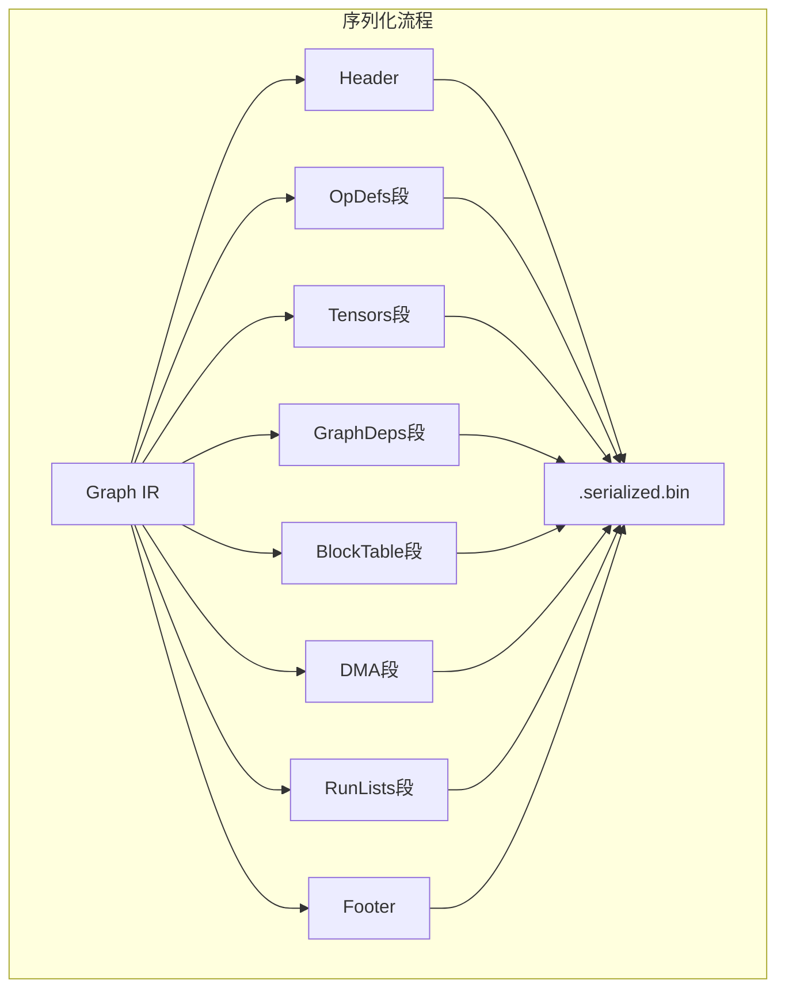

### 6.2 八段文件格式

Hexagon序列化格式分为八个段：Header、OpDefs、Tensors、GraphDeps、BlockTable、DMA、RunLists、Footer。

Header（256字节）包含magic number（'HTPS'）、版本号、段数量、总大小、CRC32校验。版本号用于向前兼容，新编译器可以加载旧格式。

OpDefs段包含所有算子的序列化表示。每个OpDef按固定大小（256字节）存储，支持随机访问。字段按编译器内部布局直接memcpy。

```cpp
// 序列化文件格式
struct SerializedBin {
    // Segment 0: Header (256 bytes)
    struct {
        uint32_t magic;           // 'HTPS' = 0x48545053
        uint32_t version;         // 0x00010000
        uint32_t num_segments;    // 8
        uint32_t header_size;     // 256
        uint64_t total_size;
        uint32_t crc32;           // 整个文件的CRC
    } header;
    
    // Segment 1: OpDefs
    struct {
        uint32_t num_ops;
        OpDef ops[];              // 变长数组，每个256字节
    } opdefs;
    
    // Segment 2: Tensors
    struct {
        uint32_t num_tensors;
        Tensor tensors[];
    } tensors;
    
    // Segment 3: GraphDeps
    struct {
        uint32_t num_tensors;
        uint64_t conflict_matrix[];  // 位图
    } deps;
    
    // Segment 4: BlockTable
    struct {
        uint32_t num_entries;
        BlockTableEntry entries[];
    } blocktable;
    
    // Segment 5: DMA
    struct {
        uint32_t num_dma;
        PortableDMA dmas[];
    } dma;
    
    // Segment 6: RunLists
    struct {
        uint32_t num_runs;
        RunListEntry runs[];
    } runlists;
    
    // Segment 7: Footer (256 bytes)
    struct {
        uint32_t magic;           // 'HTPE' = 0x48545045
        uint32_t checksum;
    } footer;
};
```

Tensors段包含张量元数据。与OpDefs分离因为张量数量通常远多于算子，且访问模式不同（DMA生成时频繁查tensor，执行时查op）。

GraphDeps段包含依赖图的压缩表示。使用位图存储邻接矩阵，每bit表示一对张量是否冲突。

BlockTable段是CBS的输出：每个张量的存储决策（bank、偏移、spill标记）。这是执行期内存分配的依据。

DMA段包含所有DMA描述符。按执行顺序排列，硬件顺序读取执行。

RunLists段是最终的执行计划。每个RunList条目表示一个执行步骤：执行算子、等待DMA、同步等。这是执行引擎的直接输入。

Footer（256字节）包含结束标记（'HTPE'）和总校验和。

### 6.3 对齐与填充

每段2KB对齐。对齐简化VTCM映射（VTCM要求2KB对齐），也利于DMA传输（DMA效率随对齐提升）。

```cpp
// 对齐宏
#define ALIGN_2K(x) (((x) + 2047) & ~2047)
#define ALIGN_128(x) (((x) + 127) & ~127)
#define ALIGN_8(x) (((x) + 7) & ~7)

// 序列化时的对齐处理
Status serializeSegment(std::vector<uint8_t>& output, 
                        const void* data, size_t size,
                        size_t alignment) {
    size_t current_size = output.size();
    size_t aligned_offset = (current_size + alignment - 1) & ~(alignment - 1);
    size_t padding = aligned_offset - current_size;
    
    // 添加padding
    output.insert(output.end(), padding, 0);
    
    // 添加数据
    const uint8_t* bytes = reinterpret_cast<const uint8_t*>(data);
    output.insert(output.end(), bytes, bytes + size);
    
    return Status::OK();
}
```

段内结构也有对齐要求。OpDef按8字节对齐，因为包含64位字段。Tensor按4字节对齐。DMA描述符按128字节对齐（某些DMA硬件要求）。

Padding字节初始化为0，确保确定性（两次编译产生相同文件）。

### 6.4 CRC32校验

Header和Footer各包含CRC32校验。Header的CRC覆盖整个文件（除自身CRC字段），Footer的CRC是冗余校验。

校验确保文件完整性。加载时重新计算CRC，与存储值比较。不匹配表示文件损坏或传输错误。

CRC32是多项式0x04C11DB7的标准实现。编译器和运行时都包含该算法。

```cpp
// CRC32实现（标准多项式0x04C11DB7）
class CRC32 {
public:
    CRC32() {
        // 预计算查找表
        for (uint32_t i = 0; i < 256; i++) {
            uint32_t crc = i;
            for (int j = 0; j < 8; j++) {
                crc = (crc >> 1) ^ (0xEDB88320 & -(crc & 1));
            }
            table[i] = crc;
        }
    }
    
    uint32_t compute(const uint8_t* data, size_t len) {
        uint32_t crc = 0xFFFFFFFF;
        for (size_t i = 0; i < len; i++) {
            crc = table[(crc ^ data[i]) & 0xFF] ^ (crc >> 8);
        }
        return ~crc;
    }
    
private:
    uint32_t table[256];
};

// 序列化时计算CRC
Status finalizeSerialization(std::vector<uint8_t>& bin) {
    CRC32 crc32;
    
    // 计算CRC（除CRC字段本身）
    uint32_t crc = crc32.compute(bin.data(), bin.size() - 4);
    
    // 写入Header的CRC字段
    *reinterpret_cast<uint32_t*>(bin.data() + 0x20) = crc;
    
    // 写入Footer的checksum
    *reinterpret_cast<uint32_t*>(bin.data() + bin.size() - 4) = crc;
    
    return Status::OK();
}
```

### 6.5 RunList结构

RunList是执行计划的最终表示。每个条目包含：类型（OP、DMA_WAIT、BARRIER等）、数据（指向OpDef或DMA描述符的索引）、依赖（前置RunList条目）。

```cpp
// RunList条目
struct RunListEntry {
    enum Type {
        OP = 0,           // 执行算子
        DMA_WAIT = 1,     // 等待DMA完成
        BARRIER = 2,      // 同步屏障
        NSP_SYNC = 3,     // 多NSP同步
        PROFILING = 4     // 性能分析点
    };
    
    uint32_t type;
    uint32_t data;        // Op索引或DMA token
    uint32_t synctoken;   // 用于同步
    uint32_t padding;     // 对齐到16字节
};

// RunList执行示例
Status executeRunList(const RunListEntry* runs, uint32_t num_runs) {
    for (uint32_t i = 0; i < num_runs; i++) {
        const RunListEntry& entry = runs[i];
        
        switch (entry.type) {
            case RunListEntry::OP: {
                // 执行算子
                const OpDef& op = opdefs[entry.data];
                executeOp(op);
                break;
            }
            
            case RunListEntry::DMA_WAIT: {
                // 等待DMA完成
                synctoken_mgr.wait(entry.synctoken);
                break;
            }
            
            case RunListEntry::BARRIER: {
                // 内存屏障
                __asm__ volatile("membar" ::: "memory");
                break;
            }
            
            case RunListEntry::NSP_SYNC: {
                // 多NSP同步
                waitForNSP(entry.data);
                break;
            }
        }
    }
    
    return Status::OK();
}
```

类型OP表示执行算子。数据字段是OpDefs段中的索引。执行引擎查OpDef，获取kernel ID和参数，调用相应函数。

类型DMA_WAIT表示等待DMA完成。数据字段是synctoken ID。执行引擎轮询synctoken直到设置。

类型BARRIER表示同步点。所有先前操作必须完成才能继续。用于确保内存一致性。

### 6.6 加载与执行

执行期加载.serialized.bin。步骤：mmap文件、验证magic和版本、验证CRC32、解析各段指针、重建运行时结构。

Mmap允许按需加载。大模型（数十MB）中，只有活跃段被实际读入内存，减少启动时间。

```cpp
// 加载执行计划
Status loadExecutionPlan(const char* filename, ExecutionContext& ctx) {
    // 1. mmap文件
    int fd = open(filename, O_RDONLY);
    struct stat st;
    fstat(fd, &st);
    
    void* mapped = mmap(nullptr, st.st_size, PROT_READ, MAP_PRIVATE, fd, 0);
    uint8_t* data = reinterpret_cast<uint8_t*>(mapped);
    
    // 2. 验证Header
    auto* header = reinterpret_cast<SerializedHeader*>(data);
    if (header->magic != 0x48545053) {
        return Status::Error("Invalid magic number");
    }
    
    // 3. 验证CRC
    CRC32 crc32;
    uint32_t computed_crc = crc32.compute(data, header->total_size - 4);
    if (computed_crc != header->crc32) {
        return Status::Error("CRC mismatch");
    }
    
    // 4. 解析各段
    ctx.opdefs = reinterpret_cast<OpDef*>(data + ALIGN_2K(sizeof(SerializedHeader)));
    ctx.tensors = reinterpret_cast<Tensor*>(data + getSegmentOffset(data, 2));
    ctx.blocktable = reinterpret_cast<BlockTableEntry*>(data + getSegmentOffset(data, 4));
    ctx.dmas = reinterpret_cast<PortableDMA*>(data + getSegmentOffset(data, 5));
    ctx.runs = reinterpret_cast<RunListEntry*>(data + getSegmentOffset(data, 6));
    ctx.num_runs = *reinterpret_cast<uint32_t*>(data + getSegmentOffset(data, 6));
    
    // 5. 重建运行时结构
    rebuildRuntimeStructures(ctx);
    
    return Status::OK();
}
```

重建运行时结构。GraphDeps的位图转换为便于查询的稀疏表示。OpDef的索引转换为直接指针。这些转换在加载时一次性完成。

执行引擎遍历RunList。对每个条目，根据类型分派：OP调用kernel；DMA_WAIT等待synctoken；BARRIER执行内存屏障。

### 6.7 多NSP执行

多NSP系统需要分发RunList。主NSP加载完整文件，解析后分发属于从NSP的部分。

分发粒度可以是层（layer0给NSP0，layer1给NSP1）或算子（细粒度负载均衡）。Hexagon编译器采用层粒度，实现简单且通信开销可控。

```cpp
// 多NSP分发
Status distributeToNSPs(ExecutionContext& ctx, uint32_t num_nsps) {
    // 按层划分
    uint32_t layers_per_nsp = ctx.num_layers / num_nsps;
    
    for (uint32_t nsp = 0; nsp < num_nsps; nsp++) {
        uint32_t start_layer = nsp * layers_per_nsp;
        uint32_t end_layer = (nsp == num_nsps - 1) ? 
                             ctx.num_layers : 
                             (nsp + 1) * layers_per_nsp;
        
        // 提取该NSP的RunList
        std::vector<RunListEntry> nsp_runs;
        for (auto& run : ctx.runs) {
            if (run.layer_id >= start_layer && run.layer_id < end_layer) {
                nsp_runs.push_back(run);
            }
        }
        
        // 发送给从NSP
        if (nsp > 0) {
            sendToNSP(nsp, nsp_runs.data(), nsp_runs.size() * sizeof(RunListEntry));
        }
    }
    
    return Status::OK();
}
```

跨NSP数据通过共享内存或消息传递同步。生产者NSP完成后发送信号，消费者NSP等待信号后开始。编译器在RunList中插入SEND/RECV指令表示这种同步。

---

## 7. 执行模型与性能考量

### 7.1 执行模型概述

图编译器生成的是静态执行计划，执行期只需解释RunList，无动态决策。这种设计最大化硬件利用率，适合实时推理。

执行模型是数据流驱动。张量就绪触发消费者算子执行。DMA完成填充输入，触发计算；计算完成产生输出，触发DMA spill或下游计算。

异步执行是常态。DMA和计算并行，多NSP间并行（只要无数据依赖）。同步点（barrier）显式标记，最小化等待。

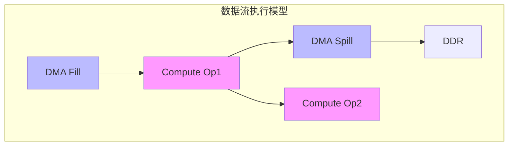

### 7.2 内存层次利用

有效利用内存层次是性能关键。编译器决策影响数据在DDR/VTCM/L1 cache间的流动。

权重通常常驻DDR，使用时fill到VTCM。大模型权重（数GB）无法驻留VTCM，必须流式加载。编译器将权重切分tile，计算tile N时预加载tile N+1。

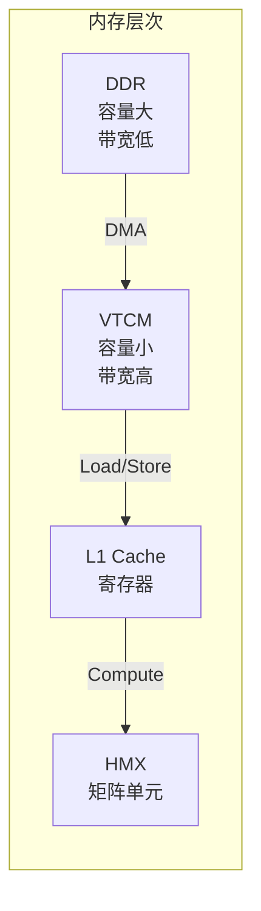

激活的生存周期短。产生后立即被消费，理想情况下不离开VTCM。但当网络层数多、VTCM不足时，必须spill中间激活。

L1 cache对scalar数据有效。控制流、小标量参数使用L1，避免VTCM争用。

### 7.3 计算与通信重叠

最大化计算与DMA重叠是性能调优的核心。理想情况：计算单元始终忙碌，DMA在后台搬运下一批数据。

重叠需要足够"独立工作"。如果网络是严格顺序的（每一层依赖前一层输出），则无法层间重叠。Transformer的attention机制有一定并行性（多个head独立计算）。

```mermaid
graph TB
    subgraph 时间线：理想重叠
        direction LR
        
        T1[时间轴] 
        
        subgraph Compute
            C1[Compute<br/>Tile 1]
            C2[Compute<br/>Tile 2]
            C3[Compute<br/>Tile 3]
        end
        
        subgraph DMA
            D1[Load<br/>Tile 2]
            D2[Load<br/>Tile 3]
            D3[Store<br/>Tile 1]
        end
        
        C1 --> C2 --> C3
        D1 --> D2
        
        C1 -.overlap.-> D1
        C2 -.overlap.-> D2
        C1 -.overlap.-> D3
    end
```

编译器调度算法估算每个算子的计算时间和DMA时间，尝试重叠独立的计算和传输。启发式：长计算（大MatMul）与长DMA（大权重加载）优先配对。

### 7.4 Bank冲突避免

VTCM的8个bank可以并行访问。如果两个算子同时访问不同bank，硬件并行执行；访问同一bank，串行执行。

CBS着色算法理论上避免bank冲突：同时活跃的张量分配不同bank。但实际执行中，由于流水线深度，严格的同时性难以预测。

编译器保守策略：确保生命周期重叠的张量在不同bank。这稍微过度约束（可能可以共享bank），但避免性能抖动。

### 7.5 Spill开销

Spill到DDR引入额外DMA传输，增加延迟和能耗。编译器目标是最小化spill数量，特别是频繁访问的张量。

Spill成本模型：如果张量只被消费一次，spill成本是一次DMA fill；如果被多次消费，每次都要fill，成本累加。编译器优先spill单次消费的大张量。

$$\text{SpillCost}(T) = \sum_{i=1}^{n} \text{DMA\_Time}(|T|) \times \mathbb{1}[T \text{ is spilled at consumption } i]$$

实际性能影响取决于DDR带宽和计算速度。如果计算远慢于DMA（如大矩阵乘法），spill开销被掩盖；如果计算快（如elementwise），spill可能成为瓶颈。

### 7.6 Profiling反馈

编译器支持profiling反馈优化。首次编译生成带instrumentation的执行计划，运行收集数据（每个算子实际执行时间、DMA传输时间、bank冲突次数），反馈给编译器重新优化。

反馈驱动的优化包括：调整CBS优先级（慢算子输出优先驻留VTCM）、调整融合决策（慢融合拆分）、调整tile大小（匹配实际内存带宽）。

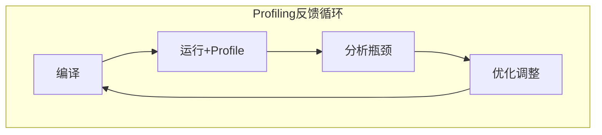

迭代优化循环：编译→执行→收集→分析→重新编译。通常在部署前完成，生成生产用的优化执行计划。

### 7.7 精度与性能权衡

量化是精度换性能。Q8_0相比F16，权重减半，但引入量化误差；Q4_0进一步减半，误差更大。

$$\text{Quantized\_Value} = \text{round}\left(\frac{\text{Float\_Value}}{\text{Scale}}\right) \times \text{Scale}$$

编译器支持混合精度：敏感层（如embedding）用F16，计算密集层（如大MatMul）用Q8_0或Q4_0。自动精度选择基于每层对最终输出的敏感度。

精度验证通过端到端测试：量化模型输出与浮点模型比较，perplexity或准确率下降在可接受范围（通常<1%）。

### 7.8 扩展性考量

图编译器设计需考虑模型规模扩展。当前大模型已达数百GB权重，远超单设备VTCM。

模型并行编译：将模型切分到多设备，每设备编译子图。编译器增加切分pass，在通信最小化的位置切分（如layer边界）。

Pipeline并行：不同层在不同设备流水执行。编译器生成多stage RunList，设备间通过队列传递激活。

这些扩展保持核心编译流程不变，增加分布式相关的pass（切分、通信插入、负载均衡）。

---

## 8. 实现技术细节

### 8.1 C++实现模式

图编译器通常用C++实现，利用STL容器管理变长数据结构（vector<OpDef>、map<TensorID, Lifetime>），利用RAII管理资源。

性能关键路径避免动态分配。CBS算法预分配所有内存，使用对象池；序列化使用固定大小缓冲区。

模板用于类型安全。Tensor<T>表示类型化张量，编译期检查类型匹配。但编译器内部通常统一用void*，类型检查在更高层。

### 8.2 内存管理

编译过程分配大量临时结构（冲突图、着色结果、优化中间表示）。使用arena allocator批量分配和释放，减少malloc开销。

```cpp
// Arena Allocator
class ArenaAllocator {
public:
    ArenaAllocator(size_t block_size = 64 * 1024 * 1024) 
        : block_size_(block_size) {
        allocateNewBlock();
    }
    
    void* allocate(size_t size, size_t alignment = 8) {
        size_t aligned_offset = (current_offset_ + alignment - 1) & ~(alignment - 1);
        
        if (aligned_offset + size > block_size_) {
            allocateNewBlock();
            aligned_offset = 0;
        }
        
        void* ptr = reinterpret_cast<char*>(current_block_) + aligned_offset;
        current_offset_ = aligned_offset + size;
        return ptr;
    }
    
    void reset() {
        // 释放所有块
        for (auto block : blocks_) {
            free(block);
        }
        blocks_.clear();
        allocateNewBlock();
    }
    
private:
    void allocateNewBlock() {
        void* block = malloc(block_size_);
        blocks_.push_back(block);
        current_block_ = block;
        current_offset_ = 0;
    }
    
    size_t block_size_;
    std::vector<void*> blocks_;
    void* current_block_;
    size_t current_offset_;
};
```

Arena按编译阶段划分。阶段结束整个arena释放，无需逐个释放对象。这利用编译的阶段特性，简化内存管理。

大对象（如邻接矩阵）用mmap分配，支持NUMA感知的放置。在服务器平台，将数据放置于访问频繁的CPU节点内存。

### 8.3 并行编译

图级并行：不同层的优化独立，可以并行执行。但CBS需要全局信息（所有张量生命周期），难以层内并行。

数据级并行：CBS的冲突检查是张量对独立，可以并行遍历。使用OpenMP或C++17 parallel算法加速。

```cpp
// 并行冲突检查
void buildConflictGraphParallel(GraphDeps& deps) {
    const size_t n = deps.num_tensors;
    
    #pragma omp parallel for schedule(dynamic)
    for (size_t i = 0; i < n; i++) {
        for (size_t j = i + 1; j < n; j++) {
            bool overlap = !(deps.lifetime_ends[i] < deps.lifetime_starts[j] ||
                           deps.lifetime_ends[j] < deps.lifetime_starts[i]);
            
            if (overlap) {
                // 使用原子操作添加冲突
                deps.addConflictAtomic(i, j);
            }
        }
    }
}
```

实际加速有限。编译时间主要消耗在IO（加载模型）和序列化（写文件），计算部分已经很快（秒级）。

### 8.4 调试与可视化

图编译器调试复杂。中间表示的变更难以追踪，优化后的图与原图差异大。

可视化工具将Graph导出为Graphviz DOT格式，显示算子连接和数据流。不同颜色表示存储类别（VTCM绿色、DDR红色、spill黄色）。

```cpp
// 导出为DOT格式
Status exportToDOT(const Graph& graph, std::ostream& out) {
    out << "digraph G {\n";
    
    // 节点
    for (const auto& op : graph.ops) {
        std::string color = "white";
        if (isFused(op)) color = "lightblue";
        else if (isOptimized(op)) color = "lightgreen";
        
        out << "  \"" << op.id << "\" [label=\"" << op.name 
            << "\", style=filled, fillcolor=" << color << "]\n";
    }
    
    // 边
    for (const auto& op : graph.ops) {
        for (const auto& input : op.inputs) {
            for (const auto& producer : input->producers) {
                std::string edge_color = "black";
                if (input->storage_class == VTCM_PERSISTENT) {
                    edge_color = "green";
                } else if (input->storage_class == DDR) {
                    edge_color = "red";
                }
                
                out << "  \"" << producer << "\" -> \"" << op.id 
                    << "\" [color=" << edge_color << "]\n";
            }
        }
    }
    
    out << "}\n";
    return Status::OK();
}
```

日志分级：INFO记录优化决策，DEBUG记录详细变换，TRACE记录每步执行。通过环境变量控制级别。

Assert验证不变量：图始终连通、张量生命周期合理、bank分配无冲突。这些assert在release模式禁用，避免运行时开销。

### 8.5 测试策略

单元测试覆盖每个pass：输入特定图结构，验证输出符合预期。

属性测试随机生成图，验证不变量（如语义保持、内存约束满足）。随机测试发现边界情况。

Golden测试与参考实现（如QNN）比较输出。字节级相同是强正确性保证；近似相同（浮点误差范围内）接受。

```cpp
// 属性测试示例：CBS无冲突
TEST(CBSProperty, NoConflicts) {
    for (int trial = 0; trial < 1000; trial++) {
        // 生成随机图
        Graph graph = generateRandomDAG(100, 200);
        
        // 运行CBS
        GraphDeps deps;
        buildConflictGraph(graph, deps);
        welshPowellColoring(deps, 8);
        
        // 验证无冲突
        for (size_t i = 0; i < deps.num_tensors; i++) {
            for (size_t j = i + 1; j < deps.num_tensors; j++) {
                if (deps.hasConflict(i, j)) {
                    // 如果冲突，必须不同bank
                    EXPECT_NE(deps.entries[i].color, deps.entries[j].color)
                        << "Conflict tensors assigned same bank";
                }
            }
        }
    }
}
```

回归测试防止性能退化。记录每个commit的编译时间和生成代码性能，趋势图显示变化。

### 8.6 与运行时接口

编译器输出与运行时严格分离。运行时是小型库，只负责加载.serialized.bin和执行RunList。

接口最小化：初始化、加载图、执行推理、释放资源。编译器不依赖运行时头文件，避免版本耦合。

版本协商：文件格式包含版本号，运行时检查兼容性。不兼容时报错，提示重新编译。

### 8.7 错误处理

编译错误分类：语法错误（输入模型格式不对）、语义错误（算子不支持）、资源错误（内存不足）、内部错误（编译器bug）。

错误恢复：语法错误尝试跳过恢复；语义错误降级到CPU执行；资源错误建议减小batch size或启用spill。

诊断信息：错误位置（算子名、张量ID）、可能原因、建议修复。类似编译器的错误报告风格。

### 8.8 性能调优

编译器自身性能调优：profile-guided优化，用实际模型作为输入profile，识别热点。

常见热点：CBS的冲突检查O(n^2)、序列化的memcpy、字符串处理（算子名hash）。优化策略：算法改进（用空间索引加速冲突检查）、SIMD（memcpy用AVX-512）、缓存（预计算hash）。

目标代码性能调优：为特定硬件生成最优代码。需要了解硬件微架构（HMX/VTCM特性），这些知识编码在target description中。

---

## 9. 前沿研究方向

### 9.1 自动调度搜索

传统编译器使用固定启发式，如CBS的Welsh-Powell。自动调度（Auto-tuning）搜索最优调度策略。

搜索空间定义：每个算子的执行顺序、每个张量的存储位置、每个DMA的时机。空间巨大，需要智能搜索。

**数学模型**：
设搜索空间为$\mathcal{S}$，评估函数为$f: \mathcal{S} \rightarrow \mathbb{R}$，目标是找到$s^* = \arg\min_{s \in \mathcal{S}} f(s)$。

启发式搜索：遗传算法、模拟退火、贝叶斯优化。评估函数是执行时间（实际运行或cost model估计）。

```
遗传算法流程:
1. 初始化种群 P_0 = {s_1, s_2, ..., s_n}
2. 评估适应度 f(s_i) for each s_i
3. while not converged:
   - 选择：根据适应度选择父代
   - 交叉：组合父代产生子代
   - 变异：随机改变子代
   - 评估：f(子代)
   - 替换：用子代替换劣解
4. 返回最优解 s*
```

实际部署：编译器生成多个候选schedule，设备上实测选择最优。适用于固定模型固定设备的场景。

### 9.2 机器学习辅助优化

用机器学习替代或增强传统优化。学习CBS的优先级函数、学习融合决策、学习tile大小选择。

训练数据：大量模型的profiling数据，特征（图结构、张量大小），标签（最优决策）。

模型：图神经网络（GNN）天然适合图结构数据，预测每个节点/边的属性；决策树解释性强，适合融合规则学习。

**GNN公式**：
对于图$G = (V, E)$，GNN的消息传递为：

$$h_v^{(l+1)} = \sigma\left(W^{(l)} \cdot \text{AGGREGATE}\left(\{h_u^{(l)} : u \in \mathcal{N}(v)\}\right) + B^{(l)} \cdot h_v^{(l)}\right)$$

挑战：训练数据收集成本高（需要大量硬件profiling），模型泛化性（未见过的模型结构）。

### 9.3 动态形状支持

当前编译器假设静态形状（编译期已知batch、sequence长度）。动态形状（如变长文本）需要新编译策略。

方案一：重新编译。形状变化时重新运行编译器。适用于变化频率低的场景。

方案二：动态规划。编译期生成多个形状的schedule，执行期选择。内存预分配最大形状，实际使用子集。

方案三：部分动态化。固定部分（如权重布局），动态部分（如激活大小）用运行时分配。

### 9.4 稀疏性优化

稀疏模型（剪枝后）有大量零值。密集计算浪费算力，稀疏格式（CSR、CSC）减少计算和存储。

CSR（Compressed Sparse Row）格式：
- values[]: 非零值
- col_idx[]: 列索引
- row_ptr[]: 每行起始位置

编译器支持稀疏格式：识别稀疏张量（零值比例高），转换存储格式，生成稀疏kernel（跳过零值乘法）。

结构化稀疏：剪枝时强制稀疏模式规则（如每行固定非零数），硬件高效支持。编译器验证稀疏模式符合硬件要求。

动态稀疏：稀疏模式运行时变化（如MoE的门控选择）。编译器生成稀疏代码模板，运行时填充实际索引。

### 9.5 跨框架统一IR

ONNX作为通用IR，但各框架扩展不同。统一IR使编译器支持多种框架（PyTorch、TensorFlow、JAX）。

MLIR（Multi-Level Intermediate Representation）是LLVM的IR框架，支持自定义dialect。Hexagon后端可以实现为MLIR dialect，复用MLIR基础设施。

好处：复用MLIR的pass管理、优化基础设施、代码生成。与LLVM生态集成，支持更多目标。

挑战：MLIR学习曲线陡峭，基础设施复杂。对于专用NPU，可能过度设计。

### 9.6 编译期量化校准

量化精度依赖校准数据集选择。自动校准选择代表性数据，最小化量化误差。

方法：聚类激活分布，选择覆盖各簇的样本；敏感度分析，选择影响输出的关键样本；对抗样本，选择量化困难的边界情况。

**KL散度校准**：
选择scale使得量化后分布与原始分布的KL散度最小：

$$\min_{scale} D_{KL}(P_{orig} || P_{quantized}(scale))$$

编译期运行校准：在host执行FP32模型收集激活统计，用于确定量化参数。这是编译器的职责。

### 9.7 安全与隔离

多租户场景下，模型推理需要安全隔离。编译器生成代码时插入安全检查。

内存隔离：每个模型的VTCM分配在独立区域，硬件MMU或软件检查防止越界。

时序隔离：最坏执行时间分析，确保模型按时完成，不影响其他任务。

**WCET分析**：
最坏执行时间（Worst Case Execution Time）分析是实时系统的关键技术。对于图编译器，需要分析：

$$\text{WCET} = \sum_{op \in \text{critical\_path}} \text{max\_exec}(op)$$

侧信道防护：常量时间实现（避免依赖秘密数据的内存访问模式），消除时序侧信道。

---

## 10. 总结

图编译器是AI加速器软件栈的核心组件，将高层次的神经网络描述转换为高效的硬件执行代码。本文基于Hexagon NPU编译器的反编译分析，深入剖析了图编译的原理和实现。

核心数据结构OpDef、Tensor、Graph构成了编译器的中间表示，支持从模型解析到代码生成的全流程。八阶段优化pipeline（Fixpoint、Fusion等）实施激进的全局优化。CBS内存规划将VTCM分配建模为图着色问题，使用贪心启发式获得近似最优解。DMA spill/fill设计在DDR和VTCM间智能搬运数据，最大化片上内存利用率。序列化格式将编译结果紧凑编码，支持快速加载和执行。

图编译器设计面临多重权衡：内存复用vs并行、算子融合vs代码膨胀、VTCM驻留vsDDR spill。这些权衡通过cost model量化，编译器选择全局最优。

随着模型规模增长和硬件多样化，图编译技术持续发展。自动调度搜索、机器学习辅助优化、动态形状支持、稀疏性优化是活跃的研究方向。图编译器将继续在AI推理性能优化中发挥关键作用。

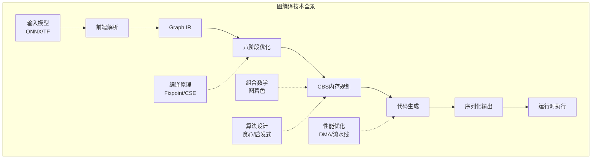
