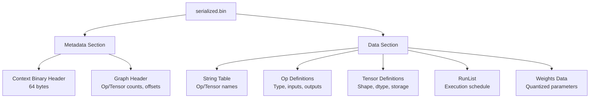
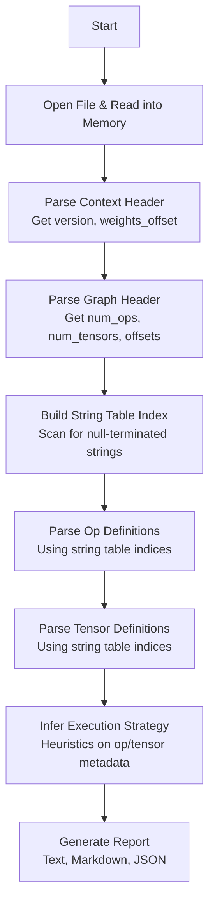
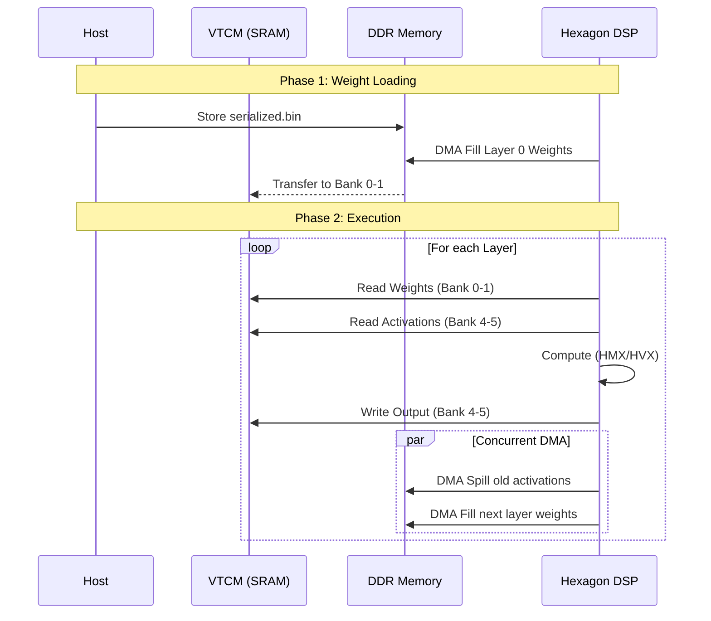

# Reverse Engineering Qualcomm QNN HTP `serialized.bin`

> A comprehensive guide to the internal data structures, parsing methodology, and execution strategy analysis of Qualcomm's QNN HTP context binary format.

---

## Table of Contents

1. [Introduction](#1-introduction)
2. [File Overview](#2-file-overview)
3. [Binary Layout](#3-binary-layout)
4. [Data Structures](#4-data-structures)
5. [Parsing Methodology](#5-parsing-methodology)
6. [Execution Strategy Inference](#6-execution-strategy-inference)
7. [Case Study: Qwen3.5-4B](#7-case-study-qwen35-4b)
8. [Appendix](#8-appendix)

---

## 1. Introduction

The Qualcomm Neural Network (QNN) HTP (Hexagon Tensor Processor) backend compiles neural network graphs into a proprietary binary format known as the **context binary**, typically stored with a `.serialized.bin` extension. This file contains everything the Hexagon DSP needs to execute the model: the graph topology, tensor metadata, operator definitions, and quantized weight data.

Understanding the internal structure of this binary is critical for:

- **Performance optimization**: Identifying bottlenecks in operator scheduling and memory usage.
- **Debugging**: Diagnosing compilation errors or runtime crashes on the DSP.
- **Custom backend development**: Building compatible compilers or runtimes.
- **Security research**: Auditing the binary for vulnerabilities.

This document provides a deep dive into the `serialized.bin` format, based on reverse engineering efforts and analysis of actual binaries files.

---

## 2. File Overview

A `serialized.bin` file is a self-contained package. For a model like Qwen3.5-4B, the compilation process splits the graph into multiple shards (e.g., `qwen3_5_4b_1_of_3.serialized.bin`), each representing a portion of the model.

### 2.1 File Characteristics

| Property | Description |
| :--- | :--- |
| **Magic** | None explicitly; version fields act as identifiers. |
| **Endianness** | Little-endian (typical for ARM/Hexagon). |
| **Alignment** | Data sections are often aligned (e.g., 2KB for weights). |
| **Size** | Can be hundreds of megabytes to over a gigabyte, mostly weights. |

### 2.2 High-Level Anatomy

The file is conceptually divided into two main parts:

1.  **Metadata Section**: A variable-size header containing version info, graph structure, and pointers to data.
2.  **Data Section**: The bulk of the file, containing operator definitions, tensor metadata, string tables, and the actual quantized weights.



---

## 3. Binary Layout

The binary layout follows a specific structure. The first 64 bytes constitute the primary header.

### 3.1 Context Binary Header (64 bytes)

This header is located at offset `0x00`.

| Offset | Size | Field | Description |
| :--- | :--- | :--- | :--- |
| `0x00` | 4 | `version_major` | Major version (e.g., `0x00000002`). |
| `0x04` | 4 | `version_minor` | Minor version (e.g., `0x00000003`). |
| `0x08` | 4 | `reserved0` | Reserved for future use. |
| `0x0C` | 4 | `num_graphs` | Number of graphs in the file (usually 1). |
| `0x10` | 4 | `graph_data_size` | Size of the graph metadata section. |
| `0x14` | 4 | `reserved1` | Reserved. |
| `0x18` | 8 | `weights_offset` | Absolute byte offset to the start of the weights data. |
| `0x20` | 16 | `reserved2` | Reserved. |

**Hex Dump of Header (from `qwen3_5_4b_1_of_3.serialized.bin`):**

```
Offset(h) 00 01 02 03 04 05 06 07 08 09 0A 0B 0C 0D 0E 0F
00000000  02 00 00 00 03 00 00 00 00 00 00 00 01 00 00 00  |................|
00000010  30 56 00 00 00 00 00 00 00 60 00 00 00 00 00 00  |0V.......`......|
```

**Interpretation:**
- `version_major` = `0x00000002` (2)
- `version_minor` = `0x00000003` (3)
- `num_graphs` = `0x00000001` (1)
- `graph_data_size` = `0x00005630` (22064 bytes)
- `weights_offset` = `0x0000000000006000` (24576 bytes)

### 3.2 Graph Header

Immediately following the context header, the graph header provides counts and offsets for the graph's components.

```c
struct QnnGraphHeader {
    uint32_t graph_id;           // Unique identifier for the graph
    uint32_t num_ops;            // Total number of operations
    uint32_t num_tensors;        // Total number of tensors
    uint32_t reserved;
    uint64_t op_defs_offset;     // Offset to the array of Op Definitions
    uint64_t tensor_defs_offset; // Offset to the array of Tensor Definitions
    uint64_t runlist_offset;     // Offset to the execution RunList
};
```

### 3.3 File Layout Visualization

```mermaid
graph LR
    subgraph File["serialized.bin"]
        direction LR
        H["Header (64 bytes)<br/>Version, Graph Count, Weights Offset"]
        G["Graph Header<br/>Num Ops, Num Tensors, Offsets"]
        S["String Table<br/>Dense null-terminated strings"]
        O["Op Definitions<br/>Op type, input/output indices"]
        T["Tensor Definitions<br/>Shape, dtype, storage class"]
        R["RunList<br/>Execution schedule"]
        W["Weights Data<br/>Quantized weights (2KB aligned)&quot;]
    end

    H --> G
    G --> S
    S --> O
    O --> T
    T --> R
    R --> W

    style H fill:#f9f,stroke:#333,stroke-width:2px
    style W fill:#bbf,stroke:#333,stroke-width:2px
```

---

## 4. Data Structures

This section details the structures used to define the computation graph and its data.

### 4.1 String Table

The binary contains a dense block of null-terminated strings. All names (for ops and tensors) are referenced by an offset into this table. This is a common technique in serialized formats to avoid redundant string storage.

**Example strings found in the binary:**
- `ar1_cl4096_1_of_3` (Graph name)
- `past_value_15_out` (Tensor name)
- `past_key_15_out` (Tensor name)
- `/model_layers_0_mlp_down_proj_Conv/Conv` (Operation name)

### 4.2 Op Definition

Each operation in the graph is defined by a structure that points to its type, inputs, and outputs via the string table or index arrays.

```c
struct OpDef {
    uint32_t name_str_idx;       // Index into string table for the op's name
    uint32_t op_type_str_idx;    // Index for the op type (e.g., "Conv", "MatMul")
    uint32_t num_inputs;
    uint32_t num_outputs;
    uint32_t input_tensor_indices[];  // Indices of input tensors
    uint32_t output_tensor_indices[]; // Indices of output tensors
    // Followed by configuration key-value pairs
};
```

**Common Op Types:**
- `Conv`: Convolution (often used for linear layers in transformers)
- `MatMul`: Matrix multiplication
- `Add`, `Mul`: Element-wise arithmetic
- `RMSNorm`: Root Mean Square Normalization
- `Sigmoid`, `SiLU`: Activation functions
- `Reshape`, `Transpose`: Tensor manipulation

### 4.3 Tensor Definition

Tensors represent the data flowing through the graph, including inputs, outputs, and intermediate activations, as well as static weights.

```c
struct TensorDef {
    uint32_t name_str_idx;       // Index into string table
    uint32_t dtype;              // Data type (e.g., FP16, Q8_0, Q4_0)
    uint32_t num_dims;           // Number of dimensions
    uint32_t dims[8];            // Shape dimensions (e.g., [batch, seq, heads, dim])
    uint32_t storage_class;      // 0 = DDR, 1 = VTCM (fast SRAM)
    uint64_t size_bytes;         // Total size in bytes
    uint64_t data_offset;        // Offset within the weights section (if static)
};
```

**Storage Classes:**
- **DDR**: Standard device memory. Used for large tensors that don't fit in SRAM.
- **VTCM**: Vector Tightly Coupled Memory. A small, fast SRAM (e.g., 16MB on V81) used for active weights and activations.

### 4.4 Data Structure Relationships

```mermaid
graph TD
    subgraph "Graph Structure"
        Op["OpDef<br/>name: 'layer_0_conv'<br/>type: 'Conv'&quot;]
        T1["TensorDef<br/>name: 'input_0'<br/>shape: [1, 4096]<br/>storage: DDR&quot;]
        T2["TensorDef<br/>name: 'weight_0'<br/>shape: [4096, 4096]<br/>storage: VTCM&quot;]
        T3["TensorDef<br/>name: 'output_0'<br/>shape: [1, 4096]<br/>storage: VTCM&quot;]
    end

    Op -- "reads input" --> T1
    Op -- "reads weight" --> T2
    Op -- "produces output&quot; --> T3

    style Op fill:#f9f,stroke:#333,stroke-width:2px
    style T1 fill:#bbf,stroke:#333,stroke-width:2px
    style T2 fill:#bbf,stroke:#333,stroke-width:2px
    style T3 fill:#bbf,stroke:#333,stroke-width:2px
```

---

## 5. Parsing Methodology

The parsing strategy involves a linear scan of the binary, identifying structures based on the header information and string patterns.

### 5.1 Algorithm Overview



### 5.2 Step 1: Header Parsing

The first step is to read the fixed-size header to understand the file's version and locate the weights.

```cpp
struct QnnContextBinaryHeader {
    uint32_t version_major;
    uint32_t version_minor;
    uint32_t reserved0;
    uint32_t num_graphs;
    uint32_t graph_data_size;
    uint32_t reserved1;
    uint64_t weights_offset;
    uint32_t reserved2[4];
};

// Parsing logic
QnnContextBinaryHeader header;
memcpy(&header, data, sizeof(QnnContextBinaryHeader));
std::cout << "Version: " << header.version_major << "." << header.version_minor << std::endl;
std::cout << "Weights at offset: 0x" << std::hex << header.weights_offset << std::dec;
```

### 5.3 Step 2: String Table Extraction

Since names are not stored inline, we must build an index of all strings. This is done by scanning the binary for printable, null-terminated sequences.

```cpp
std::string ReadString(const uint8_t* data, size_t offset, size_t max_len = 256) {
    std::string result;
    for (size_t i = 0; i < max_len; ++i) {
        char c = data[offset + i];
        if (c == '\0') break;
        result += c;
    }
    return result;
}
```

### 5.4 Step 3: Op and Tensor Parsing

Using the counts from the Graph Header, we iterate over the Op and Tensor definition arrays. The `name_str_idx` and `op_type_str_idx` fields are used to look up the actual names in the string table.

```cpp
for (uint32_t i = 0; i < graph_header.num_ops; ++i) {
    OpDef op = ParseOpDef(data, op_defs_offset + i * sizeof(OpDef));
    op.name = string_table[op.name_str_idx];
    op.op_type = string_table[op.op_type_str_idx];
    // ... store op
}
```

### 5.5 Step 4: Heuristic Analysis

Because the binary does not explicitly store "execution strategy" in a human-readable format, the parser uses heuristics to infer it:

- **Layer Grouping**: Op names like `/model_layers_0_...` are parsed to group ops by layer.
- **Weight Caching**: The total size of a layer's weights is compared against the VTCM budget (e.g., 16MB). If weights fit, they are assumed to be cached in VTCM.
- **Op Classification**: The op type string (e.g., "Conv", "MatMul") is used to classify ops and estimate if they run on HMX (matrix) or HVX (vector) units.

---

## 6. Execution Strategy Inference

The `serialized.bin` file is the output of a sophisticated compiler (`libHtpPrepare.so`). The execution strategy is encoded in the operator scheduling, tensor storage classes, and the RunList.

### 6.1 VTCM Memory Management

The Hexagon DSP has a limited amount of VTCM (e.g., 16MB). The compiler uses a strategy similar to **register allocation** to manage this space:

- **Weight Caching**: Frequently used weights (e.g., for the current layer) are kept in VTCM.
- **Activation Buffers**: Intermediate results are stored in VTCM if they are reused soon.
- **Spilling**: If VTCM is full, less critical data is "spilled" back to DDR.

```mermaid
graph TD
    subgraph "VTCM Budget (e.g., 16MB)&quot;
        A[Layer N Weights<br/>~10MB]
        B[Layer N Activations<br/>~4MB]
        C[Spill/Fill Buffers<br/>~2MB]
    end

    style A fill:#f9f,stroke:#333,stroke-width:2px
    style B fill:#bbf,stroke:#333,stroke-width:2px
    style C fill:#bfb,stroke:#333,stroke-width:2px
```

### 6.2 DMA and Double Buffering

To hide memory latency, the DSP uses DMA (Direct Memory Access) to transfer data between DDR and VTCM concurrently with computation. A common pattern is **double buffering**:

1.  **Compute**: The DSP computes on data in **Buffer A**.
2.  **DMA Fill**: Simultaneously, the DMA engine fills **Buffer B** with the next layer's weights from DDR.
3.  **Swap**: Once compute and DMA are complete, the buffers are swapped (pointers are updated), and the process repeats.



### 6.3 RunList and Scheduling

The `RunList` is the final execution schedule. It is an ordered list of steps that the DSP firmware iterates through. Each step might be:
- **Compute Step**: Execute a specific operator.
- **DMA Step**: Initiate a DMA transfer.
- **Sync Step**: Wait for previous compute or DMA steps to complete.

The compiler's goal is to maximize overlap between compute and DMA (memory bandwidth) to keep the DSP cores busy.

---

## 7. Case Study: Qwen3.5-4B

This section applies the parsing methodology to a real-world model: **Qwen3.5-4B**, compiled for the QNN HTP backend.

### 7.1 File Characteristics

The model is split into three shards:

| Shard | File Size | Total Ops | Total Tensors |
| :--- | :--- | :--- | :--- |
| 1 of 3 | 918 MB | 6,696 | 938 |
| 2 of 3 | ~839 MB | ~6,000 | ~800 |
| 3 of 3 | ~648 MB | ~131 | ~50 |

### 7.2 Header Analysis

For `qwen3_5_4b_1_of_3.serialized.bin`:

```
Version: 2.3
Num Graphs: 1
Graph Data Size: 22064 bytes
Weights Offset: 0x6000 (24576 bytes)
```

The weights start at offset `0x6000`. Everything before this is metadata.

### 7.3 Op Type Distribution (Shard 1)

| Op Type | Count | Percentage |
| :--- | :--- | :--- |
| Reshape | 681 | ~10.2% |
| Mul | 469 | ~7.0% |
| Add | 417 | ~6.2% |
| MatMul | 416 | ~6.2% |
| Conv | 268 | ~4.0% |
| Transpose | 169 | ~2.5% |
| Sigmoid | 118 | ~1.8% |
| ... | ... | ... |

**Observation**: The high number of `Reshape` and `Transpose` ops is typical for transformer models, where tensor dimensions are frequently manipulated for attention mechanisms.

### 7.4 Layer Distribution

The ops are grouped by layer. The distribution shows a repeating pattern corresponding to the transformer's block structure:

| Layer | Op Count | Notes |
| :--- | :--- | :--- |
| 0 | 238 | Embedding + first transformer block |
| 1 | 238 | Transformer block |
| 2 | 238 | Transformer block |
| 3 | 918 | Likely an attention-heavy section or mis-grouped ops |
| ... | ... | ... |
| 16 | 216 | Final layers |

### 7.5 Execution Strategy Inference

Based on the parsed data, the inferred execution strategy for Shard 1 is:

**Memory Layout:**
- **VTCM Total**: 16 MB
- **Weight Cache**: ~10 MB (80% of budget)
- **Activations**: ~4 MB (25%)
- **Spill/Fill**: ~2 MB (12.5%)

**DMA Timeline:**
1. **T0**: DMA Fill Layer 0 weights into VTCM Banks 0-1.
2. **T100**: DSP computes Layer 0 using weights from Banks 0-1 and activations from Banks 4-5.
3. **T500**: Concurrently, DMA Fill Layer 1 weights into Banks 2-3.
4. **T600**: DMA Spill Layer 0 output activations from Banks 4-5 back to DDR.

```mermaid
gantt
    title Execution Timeline for Layer 0 & 1
    dateFormat  X
    axisFormat %s

    section DMA
    Fill L0 Weights    :a1, 0, 100
    Fill L1 Weights    :a2, 500, 600
    Spill L0 Output    :a3, 600, 700

    section Compute
    Execute Layer 0    :c1, 100, 500
    Execute Layer 1    :c2, 600, 1000
```



### 7.6 Multi-Shard Execution

The three shards represent a pipeline. The output of Shard 1 becomes the input for Shard 2, and so on. This splitting is necessary because the full model's weights exceed the VTCM capacity, and it allows the host CPU to manage the loading of different shards.

```mermaid
graph LR
    subgraph "Model Execution Pipeline&quot;
        A[Input Tokens] --> B[Shard 1<br/>Layers 0-5<br/>918 MB]
        B --> C[Shard 2<br/>Layers 6-10<br/>839 MB]
        C --> D[Shard 3<br/>Layers 11-16 + Head<br/>648 MB]
        D --> E[Output Logits]
    end

    style B fill:#f9f,stroke:#333,stroke-width:2px
    style C fill:#bbf,stroke:#333,stroke-width:2px
    style D fill:#bfb,stroke:#333,stroke-width:2px
```

---

## 8. Appendix

### 8.1 C++ Parser Skeleton

Here is a minimal skeleton for a parser based on the structures described:

```cpp
#include <cstdint>
#include <cstdio>
#include <vector>
#include <string>
#include <iostream>

#pragma pack(push, 1)
struct QnnContextBinaryHeader {
    uint32_t version_major;
    uint32_t version_minor;
    uint32_t reserved0;
    uint32_t num_graphs;
    uint32_t graph_data_size;
    uint32_t reserved1;
    uint64_t weights_offset;
    uint32_t reserved2[4];
};
#pragma pack(pop)

class SerializedBinParser {
    uint8_t* data_;
    size_t size_;
    QnnContextBinaryHeader header_;

public:
    explicit SerializedBinParser(const std::string& path) : data_(nullptr), size_(0) {
        FILE* fp = fopen(path.c_str(), "rb");
        if (!fp) return;
        fseek(fp, 0, SEEK_END);
        size_ = ftell(fp);
        fseek(fp, 0, SEEK_SET);
        data_ = new uint8_t[size_];
        fread(data_, 1, size_, fp);
        fclose(fp);
    }

    bool ParseHeader() {
        if (size_ < sizeof(QnnContextBinaryHeader)) return false;
        memcpy(&header_, data_, sizeof(QnnContextBinaryHeader));
        return true;
    }

    void DumpHeader() const {
        std::cout << "Version: " << header_.version_major << "." << header_.version_minor << "\n";
        std::cout << "Weights Offset: 0x" << std::hex << header_.weights_offset << std::dec << "\n&quot;;
    }

    ~SerializedBinParser() { delete[] data_; }
};

int main(int argc, char* argv[]) {
    if (argc < 2) return 1;
    SerializedBinParser parser(argv[1]);
    if (parser.ParseHeader()) {
        parser.DumpHeader();
    }
    return 0;
}
```

### 8.2 Data Type Mappings

| QNN Data Type | ID | Description |
| :--- | :--- | :--- |
| `QNN_DATATYPE_FLOAT_16` | ? | 16-bit floating point (FP16) |
| `QNN_DATATYPE_UFIXED_POINT_8` | ? | 8-bit unsigned fixed point |
| `QNN_DATATYPE_UFIXED_POINT_16` | ? | 16-bit unsigned fixed point |
| `QNN_DATATYPE_FLOAT_32` | ? | 32-bit floating point |

### 8.3 Glossary

| Term | Definition |
| :--- | :--- |
| **QNN** | Qualcomm Neural Network SDK |
| **HTP** | Hexagon Tensor Processor (the DSP backend) |
| **VTCM** | Vector Tightly Coupled Memory (fast SRAM on DSP) |
| **DDR** | Double Data Rate memory (standard device RAM) |
| **DMA** | Direct Memory Access (hardware transfer engine) |
| **HMX** | Hexagon Matrix Extensions (accelerates MatMul/Conv) |
| **HVX** | Hexagon Vector Extensions (accelerates element-wise ops) |
| **CBS** | Constraint-Based Scheduling (memory allocation algorithm) |
| **RunList** | Ordered sequence of execution steps for the DSP |
